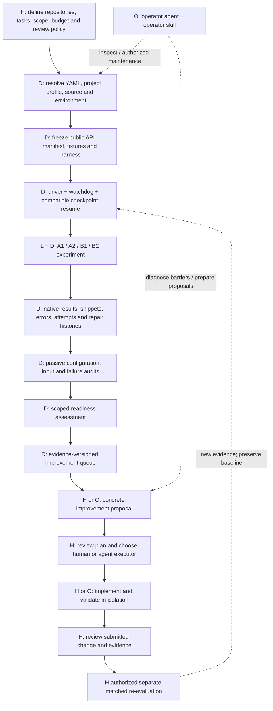
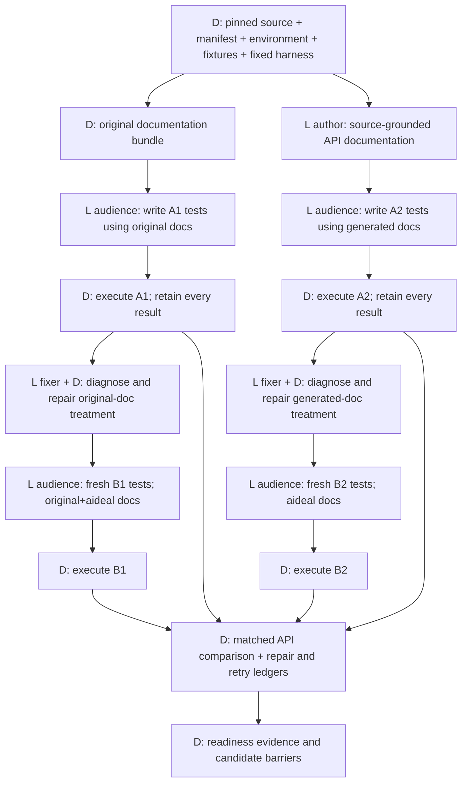
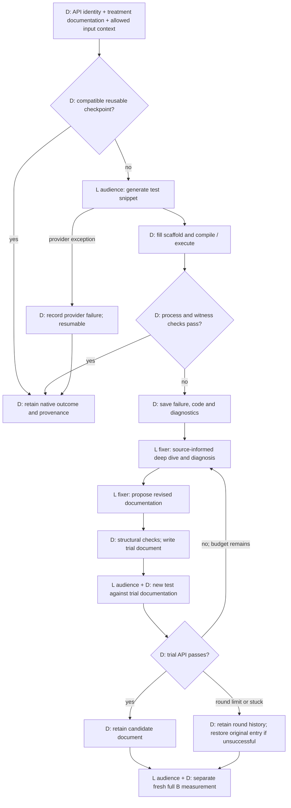
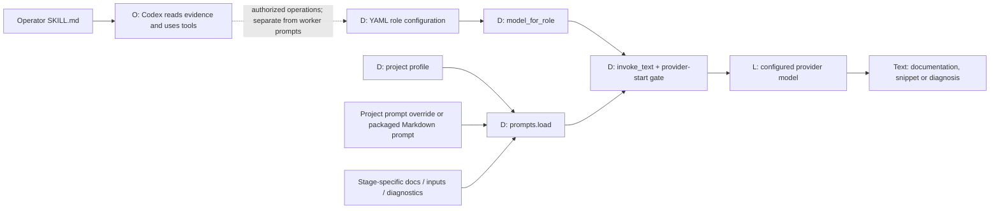
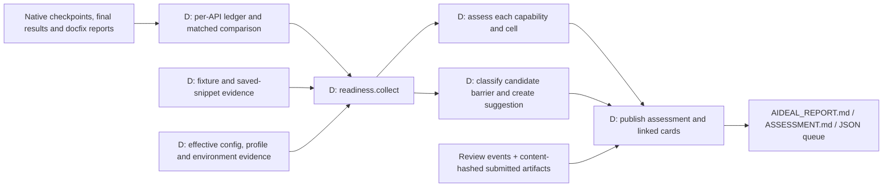
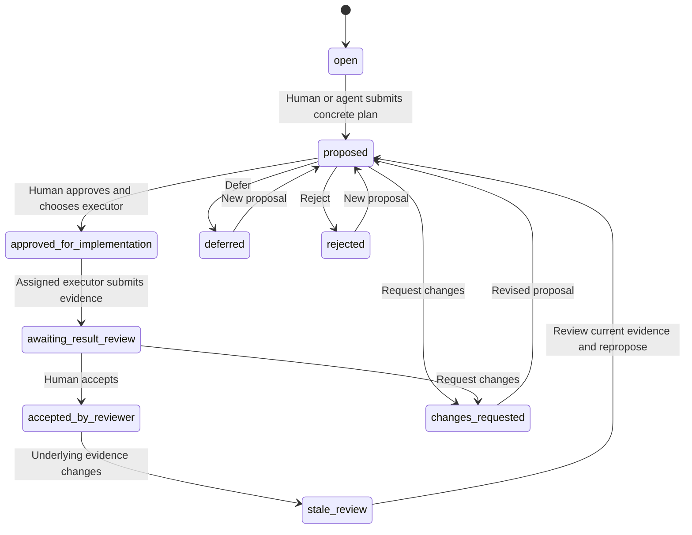

# AIDEAL: design, execution logic, and code navigation

Source inspected September 7, 2026, at `8738c5d3ed055c67326b72a8b03758cff845f2f0`.
This guide describes implementation boundaries, not current completion counts.
See [design decisions](AIDEAL_DESIGN_LOGIC.md), the
[data and API methods appendix](experiments/external/FINAL_REPORT_DATA_AND_API_METHODS.md),
and the generated `AIDEAL_REPORT.md` in the audit report directory for results.

**Central product:** an evidence-backed assessment of how usable a codebase is
for agents, followed by a reviewable improvement queue. The strongest current
measurement is documentation-conditioned API execution under a fixed harness.
Independent discovery, installation, and held-out workflow success are not yet
measured by the priority study; there is no overall readiness score.

For a presentation-friendly figure, the verbatim conversation memo, and the paper literature review, open the [design and research package](docs/paper/README.md).

September 7 extension: [source-informed snippet recovery](experiments/external/recovery/README.md)
is implemented and staged outside the running study. Its diagram and function
map distinguish feedback-only repair, source-assisted repair, fixed study
stagnation limits, and independent human review. It adds no headline B2 code-fix
rounds and has not yet had a live provider/API validation run.

## 1. Legend and system boundary

| Label | Meaning | Does it require an LLM? |
|---|---|---|
| H | Human decision or review | No; an agent may prepare evidence |
| D | Deterministic automation: parsing, scheduling, execution, validation, reporting | No |
| L | A configured model produces documentation, code, or diagnosis | Yes |
| O | An operator agent such as Codex reads evidence and uses tools | Yes, in the operator session; separate from experiment model calls |
| Optional | Implemented framework path, not evidence that the priority run uses it | Depends on the path |
| Staged | New protocol building block that is not wired into active workers | Not active |

Autonomous and LLM-driven are different properties. A watchdog is autonomous
without an LLM. The document-repair loop is autonomous and uses an LLM. A human
approval is neither an LLM call nor an automatic implementation step.

The right side of the product loop is a **recorded review workflow**. The
readiness CLI does not spawn an implementation agent, apply a patch, merge a
branch, run a new experiment, or independently certify submitted validation.
Those are explicit human/operator actions under the user's authorization.

## 2. The executable 2×2 study

The diagram expresses logical dependencies, not a promise that all nodes run
simultaneously. Repository drivers determine actual admission and ordering.
Priority denominators are 148 mir_eval API names, 149 Thumbnailator names,
and 235 tslearn names. Names, overloads, and definition sites are different
counts. MDAnalysis, Sedona preparation, and RDPro reruns are deferred under the
current priorities; historical RDPro evidence is retained separately.

| Component | Code entry point | Mode and responsibility |
|---|---|---|
| Effective configuration | [`config.load_config()`](grail-agent/src/aideal/config.py#L201), [`_load_layered()`](grail-agent/src/aideal/config.py#L187) | D: defaults, directly listed layers, then project overrides. Nested `extends` is not recursively expanded. |
| Project intent and constraints | [`profile.require_profile()`](grail-agent/src/aideal/profile.py#L67), [`project_context()`](grail-agent/src/aideal/profile.py#L125) | D validates fields; H determines meaningful goals, users, constraints and scope. |
| Public API discovery and identity | [`readme_agent.public_api_surface()`](grail-agent/src/aideal/readme_agent.py#L1173), [`public_api_details()`](grail-agent/src/aideal/readme_agent.py#L2070) | D in the full-surface study: discover candidate names and definition evidence. Repository setup freezes and validates the denominator. |
| Coverage and document structure | [`api_coverage()`](grail-agent/src/aideal/readme_agent.py#L2741), [`doc_checks.form_check()`](grail-agent/src/aideal/doc_checks.py#L125), [`completeness_check()`](grail-agent/src/aideal/doc_checks.py#L1628) | D: structural checks; coverage does not establish semantic correctness. |
| Original-document preparation | [`doc_snapshot.prepare_original_docs()`](grail-agent/src/aideal/doc_snapshot.py#L52) | D: prepare the original-document bundle. |
| Source-grounded document generation | [`readme_agent.find_or_create()`](grail-agent/src/aideal/readme_agent.py#L2375), [`distilled_readme_context()`](grail-agent/src/aideal/readme_agent.py#L2320) | D collects evidence and resumes; L author generates entries/context. Failure fallback skeletons are not equivalent to completed generation. |
| Existing test examples and scaffold | [`api_test_examples()`](grail-agent/src/aideal/readme_agent.py#L754), [`generate_scaffold()`](grail-agent/src/aideal/readme_agent.py#L1068) | D mines examples and constructs a scaffold. Repository fixtures and checked-in scaffolds still need setup validation. |
| Fixture resolution | [`doc_checks._execute_sample_data()`](grail-agent/src/aideal/doc_checks.py#L845), [`_validate_sample_data()`](grail-agent/src/aideal/doc_checks.py#L639), [`_discover_fixtures()`](grail-agent/src/aideal/doc_checks.py#L674) | D resolves configured data and basic validity. This is not proof of valid inputs for every API. |
| Treatment document selection | [`_comprehension_inventory()`](grail-agent/src/aideal/doc_checks.py#L328), [`_relevant_doc_inventory()`](grail-agent/src/aideal/doc_checks.py#L306) | D builds the selected documentation context for the frozen API inventory. |
| Test generation and execution | [`comprehension_check()`](grail-agent/src/aideal/doc_checks.py#L426), [`_comprehension_execute()`](grail-agent/src/aideal/doc_checks.py#L1056) | L audience writes code; D fills scaffold, invokes configured command, classifies output and saves evidence. |
| Checkpoint compatibility | [`_comprehension_fingerprint_components()`](grail-agent/src/aideal/doc_checks.py#L62), [`_checkpoint_row_reusable()`](grail-agent/src/aideal/doc_checks.py#L115) | D binds reusable rows to the experiment fingerprint. A file existing does not establish compatibility. |
| Document diagnosis and repair | [`docfix.doc_fix_run()`](grail-agent/src/aideal/docfix.py#L315), [`deepdive.deep_dive_run()`](grail-agent/src/aideal/deepdive.py#L61) | L fixer diagnoses and rewrites; D controls rounds, evidence persistence, retesting, stopping and restoration. |
| External repository driver | [`run_external_2x2_pipeline.main()`](experiments/external/run_external_2x2_pipeline.py#L262), [`make_job()`](experiments/external/run_external_2x2_pipeline.py#L179), [`upstream_after()`](experiments/external/run_external_2x2_pipeline.py#L244) | D orchestrates mir_eval/Thumbnailator worktrees, job definitions, comparisons and upstream tests. |
| Resumable document worker | [`run_resumable_readme.main()`](experiments/external/run_resumable_readme.py#L14) | D entry point for resumable generation; delegates L generation to the core. |
| Job supervisor | [`Supervisor.preflight()`](experiments/external/run_condition_watchdog.py#L174), [`eligible()`](experiments/external/run_condition_watchdog.py#L194), [`run()`](experiments/external/run_condition_watchdog.py#L264), [`completion()`](experiments/external/run_condition_watchdog.py#L59) | D checks prerequisites, schedules children, checks completion and resumes under the job policy. |

The tslearn full235 driver lives in the sibling worktree
`GRAIL_tslearn_full235_freeze/experiments/tslearn/run_full235_pipeline.py`:
`main()` at line 292, `validate()` at 153, `comprehension_job()` at 213,
and `repair_job()` at 234. It is not a file in this main branch. Resolve
worktree locations from the running watchdog plan when navigating actual jobs.

### One API, one test, and one repair loop

Current final A1/A2/B1/B2 measurements use **zero snippet-fix rounds**. Document
repair is a different intervention: at most five document rounds and a
two-stuck-round stop. Provider retries and watchdog relaunches are another
category; `max_restarts: 0` means unlimited in the current supervisor.
SDK-internal transport retries are not fully represented as separate attempts.

The execution gate checks exit code, success/error markers, and the configured
correctness witness. The prompt asks for meaningful falsifiable assertions;
the gate does not independently prove that the correct API was exercised with
valid data or that the assertion is a sound oracle. A repaired entry passing
one trial is also not proof of no regression elsewhere. Fresh B measurements
and independent validation remain necessary; do not union successful repair
trials into an artificial final B result.

## 3. Where the LLM, prompts, and operator skills enter

| LLM use | Function and prompt | Information boundary |
|---|---|---|
| Author documentation | [`find_or_create()`](grail-agent/src/aideal/readme_agent.py#L2375); [`readme_entry.md`](grail-agent/src/aideal/default_prompts/aideal/readme_entry.md) | Source/signatures/examples may inform generated documentation. |
| Author context distillation | [`distilled_readme_context()`](grail-agent/src/aideal/readme_agent.py#L2320); [`readme_distill.md`](grail-agent/src/aideal/default_prompts/aideal/readme_distill.md) | Produces reusable context for document generation. |
| Audience executable test | [`_comprehension_execute()`](grail-agent/src/aideal/doc_checks.py#L1056); [`comprehension_write_exec.md`](grail-agent/src/aideal/default_prompts/aideal/comprehension_write_exec.md) | Selected treatment docs, receiver and harness/input context. First attempt excludes historical failure feedback. Independent source-informed review must remain separate. |
| Fixer deep dive | [`deep_dive_run()`](grail-agent/src/aideal/deepdive.py#L61); [`deep_dive.md`](grail-agent/src/aideal/default_prompts/aideal/deep_dive.md) | Source, types, call sites, failure history and current entry. `context_only` avoids the LLM call. |
| Fixer diagnosis and rewrite | [`doc_fix_run()`](grail-agent/src/aideal/docfix.py#L315); [`docfix_diagnose.md`](grail-agent/src/aideal/default_prompts/aideal/docfix_diagnose.md), [`docfix_rewrite.md`](grail-agent/src/aideal/default_prompts/aideal/docfix_rewrite.md) | Source-informed intervention on documents, followed by a fresh audience trial. |
| Optional grounding probe | [`probe.run_probe()`](grail-agent/src/aideal/probe.py#L194); [`probe_write.md`](grail-agent/src/aideal/default_prompts/aideal/probe_write.md) | Can use template code or an audience LLM; not automatically active for every API. |
| Optional intent ranking | [`intended_api_llm()`](grail-agent/src/aideal/readme_agent.py#L1296); [`intent_common.md`](grail-agent/src/aideal/default_prompts/aideal/intent_common.md), [`intended_review.md`](grail-agent/src/aideal/default_prompts/aideal/intended_review.md) | Optional selection; not the static full-surface denominator of this study. |
| Optional task generation | [`task_generator.generate_tasks()`](grail-agent/src/aideal/task_generator.py#L25); [`tasks_generate.md`](grail-agent/src/aideal/default_prompts/aideal/tasks_generate.md) | Author creates candidate integration tasks; generated tasks still need benchmark review. |
| Optional non-execution comprehension | [`comprehension_check()`](grail-agent/src/aideal/doc_checks.py#L426); [`comprehension_write.md`](grail-agent/src/aideal/default_prompts/aideal/comprehension_write.md), [`comprehension_grade.md`](grail-agent/src/aideal/default_prompts/aideal/comprehension_grade.md) | LLM grading exists outside the executable-study pass criterion. |

[`config.AidealConfig.model_for_role()`](grail-agent/src/aideal/config.py#L79)
resolves author/audience/fixer. These are **roles, not necessarily different
models or independent agents**; the priority configuration maps them to Gemini.
[`prompts.load()`](grail-agent/src/aideal/prompts.py#L29) resolves a project
override first, then the packaged default; it fills SYSTEM/USER placeholders
with stage context and profile fields. Optional automatic preambles and I/O
hints also have inline prompts in
[`_resolve_preamble()`](grail-agent/src/aideal/doc_checks.py#L753) and
[`_resolve_io_hints()`](grail-agent/src/aideal/doc_checks.py#L806).

Therefore the reproducible configuration is **not one YAML file**. It includes
effective YAML layers, profile, prompt files, source revision, manifest,
fixtures, scaffold, interpreter/dependencies, commands and relevant environment
variables. [`automation.observe.bundle()`](experiments/external/automation/observe.py#L45)
records the resolved configuration evidence. The actual invocation boundary is
[`llm.invoke_text()`](grail-agent/src/aideal/llm.py#L138); model clients are built
by [`get_chat_model()`](grail-agent/src/aideal/llm.py#L23).

The [operator skill](.agents/skills/aideal-experiment-operator/SKILL.md)
instructs the conversational operator to inspect supervisors, preserve outputs,
diagnose evidence and report limitations. It is not loaded as a Gemini worker
prompt and does not itself start a background process. The engineering
documentation skill assists this guide's authoring; it is not an experimental
treatment or runtime AIDEAL component.

## 4. Evidence becomes an assessment and improvement queue

| Component | Code entry point | Output and limitation |
|---|---|---|
| Result and round ledger | [`audit_overnight.summarize()`](experiments/external/audit_overnight.py#L103), [`inspect_cell()`](experiments/external/audit_overnight.py#L178) | D retains status, category, compatible attempts and repair evidence; unresolved provider failures remain visible. |
| Four-cell comparison | [`comparison_report()`](experiments/external/audit_overnight.py#L292), [`audit()`](experiments/external/audit_overnight.py#L442) | D reports matched results and missing evidence; no LLM judges the report. |
| Fixture and snippet evidence | [`audit_experiment_data.fixture_evidence()`](experiments/external/audit_experiment_data.py#L47), [`snippet_evidence()`](experiments/external/audit_experiment_data.py#L79), [`inspect()`](experiments/external/audit_experiment_data.py#L97) | D records data identity, metadata and saved code references. Does not certify every input's semantic suitability. |
| Passive automation observer | [`automation.observe.observe()`](experiments/external/automation/observe.py#L114) | D produces configuration, ownership, static snippet evidence and scoped forecasts without executing snippets or calling models. |
| Candidate failure classification | [`automation.analysis.classify()`](experiments/external/automation/analysis.py#L39) | D classification uses recorded review evidence when present. A candidate category alone is not a causal finding. |
| Readiness assessment | [`readiness.model.assess()`](experiments/external/readiness/model.py#L13) | D checks denominator and evidence status; complete API results can be measured while other capabilities remain unmeasured. |
| Improvement suggestion | [`readiness.model.suggestion()`](experiments/external/readiness/model.py#L69) | D creates stable ID, evidence version, candidate diagnosis, action, validation criteria, risks and executor options. No LLM call or automatic patch. |
| Collection and publication | [`readiness.report.collect()`](experiments/external/readiness/report.py#L20), [`publish()`](experiments/external/readiness/report.py#L81) | D writes assessment JSON/Markdown and queue/cards; preserves review history. |
| Review consistency and state | [`readiness.review.history()`](experiments/external/readiness/review.py#L9), [`state()`](experiments/external/readiness/review.py#L22), [`validate()`](experiments/external/readiness/review.py#L42) | D binds decisions to current evidence and checks required state/actor labels. |
| Review evidence persistence | [`readiness.review.record()`](experiments/external/readiness/review.py#L73) | D saves content-hashed submission artifacts and appends the decision history. |
| CLI and serialized writes | [`readiness.__main__.main()`](experiments/external/readiness/__main__.py#L22), [`locked()`](experiments/external/readiness/__main__.py#L16) | D exposes publish/review commands and serializes review/publication writes. |

### Human review state machine

This shows the normal review route, not every transition the implementation
permits. Changed underlying evidence can make **any** prior review stale.
Reproposing clears the previous approval/executor/result. Defer, reject and
request-changes actions are supported for both actor types; approval and final
acceptance specifically require `actor_type: human`.

| Human involvement | Why it is needed | Current enforcement |
|---|---|---|
| Define the question, relevant API/workflow scope, acceptable cost and protocol | Code cannot decide the user's research objective or acceptable evidence | Project/profile/config choices; not an interactive prompt for every job |
| Review semantic validity and interpret causal claims | A passing generated assertion is not an independent oracle | Evidence and review process; not universally automated or guaranteed |
| Approve a concrete improvement plan and select executor | User controls proposed changes beyond the authorized experiment | Review-state validation requires a human label and a proposed plan |
| Accept submitted improvement evidence | Decide whether the change and evidence satisfy the reviewed objective | Review-state validation requires human acceptance after submission |
| Authorize a new treatment/re-evaluation or publication when outside existing scope | Such changes can alter measured protocol and interpretation | Actual user/operator authorization; the queue does not grant permission |

The already authorized experiment's LLM generation, tests, retries and B
document-repair treatments do not pause for human review per API. This is
separate from the central improvement queue's review lifecycle. Actor labels
are self-reported audit data, not authenticated identities or access control.
Likewise, submitted `validation_status: passed` is a declaration for review;
the CLI does not rerun tests to verify it. See the
[review workflow and exact commands](experiments/external/readiness/WORKFLOW.md).

## 5. Optional framework paths and staged extensions

| Capability | Refer to | Actual status |
|---|---|---|
| Multi-API puzzle/workflow runner | [`doc_checks.puzzle_check()`](grail-agent/src/aideal/doc_checks.py#L1654), [`puzzle_bank.freeze_puzzle_plan()`](grail-agent/src/aideal/puzzle_bank.py#L174), [`verify_plan_inputs()`](grail-agent/src/aideal/puzzle_bank.py#L257) | Optional D orchestration freezes cases/data and runs the configured application runner. LLM involvement depends on that runner. Not the priority held-out workflow benchmark. |
| Error memory | [`ErrorLog.append()`](grail-agent/src/aideal/error_log.py#L68), [`failures_for()`](grail-agent/src/aideal/error_log.py#L113) | D storage and retrieval; feedback may enter enabled retry paths. First final-comprehension attempts exclude historical feedback. |
| Notes-to-self distillation | [`NotesToSelf.distill()`](grail-agent/src/aideal/notes_to_self.py#L53) | D repeated-error/fix extraction, despite the name; no LLM distillation call. |
| Alias tracking and wrappers | [`ErrorLog.suggest_aliases()`](grail-agent/src/aideal/error_log.py#L135), [`AliasRegistry.report()`](grail-agent/src/aideal/alias_registry.py#L85), [`alias_functions.sync()`](grail-agent/src/aideal/alias_functions.py#L84) | D suggestions and template wrappers. Default wrapper specifications are RDPro-specific, not a generic autonomous refactoring engine. |
| Agent tool integration | [`mcp_server.comprehension_check()`](grail-agent/src/aideal/mcp_server.py#L66), [`puzzle_check()`](grail-agent/src/aideal/mcp_server.py#L77), [`main()`](grail-agent/src/aideal/mcp_server.py#L121) | Optional MCP interface exposes framework tools to an external agent. LLM use follows the delegated function; not proof an MCP server is currently running. |
| Shared provider-start spacing | [`llm._wait_for_provider_slot()`](grail-agent/src/aideal/llm.py#L72) | Active D Google request-start gate using a shared local file lock when configured. It is not a full token/day/concurrency quota manager. |
| Output ownership and timing evidence | [`analysis.overlaps()`](experiments/external/automation/analysis.py#L58), [`forecast()`](experiments/external/automation/analysis.py#L5) | Passive D overlap checks and comprehension-only timing scenarios. Neither guarantees absence of every runtime write conflict nor completion by the deadline. |
| Input contracts and static snippet review | [`contracts.validate_inputs()`](experiments/external/automation/contracts.py#L9), [`lint_python()`](experiments/external/automation/contracts.py#L40) | D helpers; passive AST review is used. Full contract enforcement and independent runtime/dataflow oracles are staged. |
| Unified quota admission | [`quota.Gate`](experiments/external/automation/quota.py#L27), [`next_protocol.yaml`](experiments/external/automation/next_protocol.yaml) | Staged local SQLite admission core. Disabled and not wired to active Gemini workers or every SDK retry. |
| Revised prompts and input-review protocol | [`PROMPTS_NEXT_PROTOCOL.md`](experiments/external/automation/PROMPTS_NEXT_PROTOCOL.md) | Staged; not loaded by active A1/A2/B1/B2 cells. |

Current parallel workers require separate mutable work/output directories and
shared provider coordination. Passive observers own separate report namespaces;
they do not generate paid calls. The quota gate, running supervisor, and
observer are distinct components and must not be conflated.

## 6. Design assessment and clean implementation boundary

The existing measurement core is useful because it produces executable,
API-specific evidence and records attempted recovery. The readiness layer
adds the product-level interpretation and review loop without rewriting native
scores. Its modules separate assessment (`model.py`), review (`review.py`),
publication (`report.py`) and CLI/locking (`__main__.py`).

The remaining design gaps are explicit: independent semantic oracles,
discovery/setup/workflow benchmarks, complete transport-level quota admission,
authenticated approvals if needed, and an implementation executor connected to
real authorization. These are development targets, not existing capabilities.
The current core also still has large modules (`readme_agent.py` and
`doc_checks.py`) and machine-specific study configuration. Portability is
partial; extracting scanners, context construction, execution and checkpoints
into small modules should be a separately tested change after frozen runs.
This guide introduces documentation only and does not change running workers.
