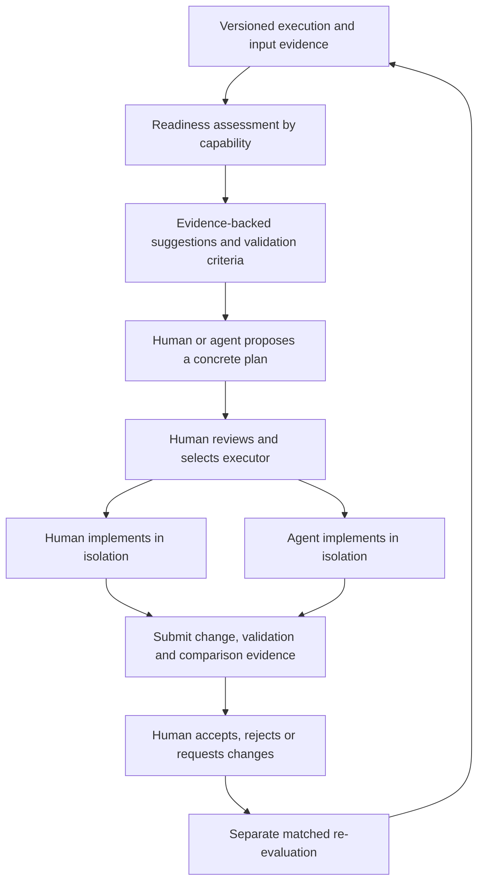
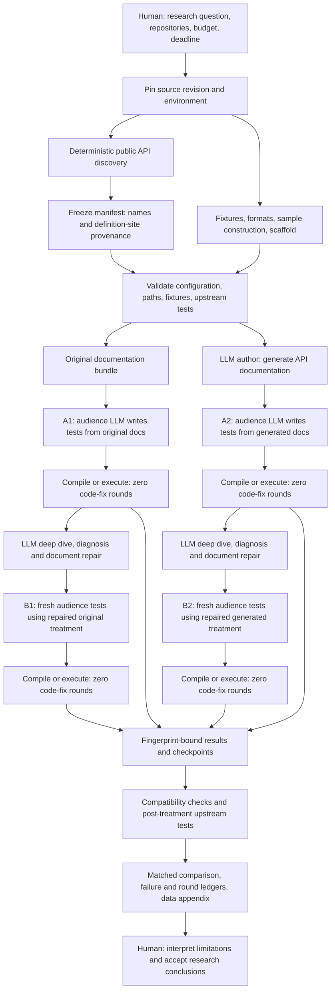
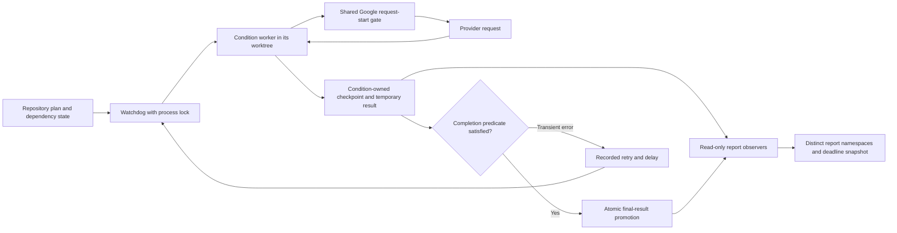
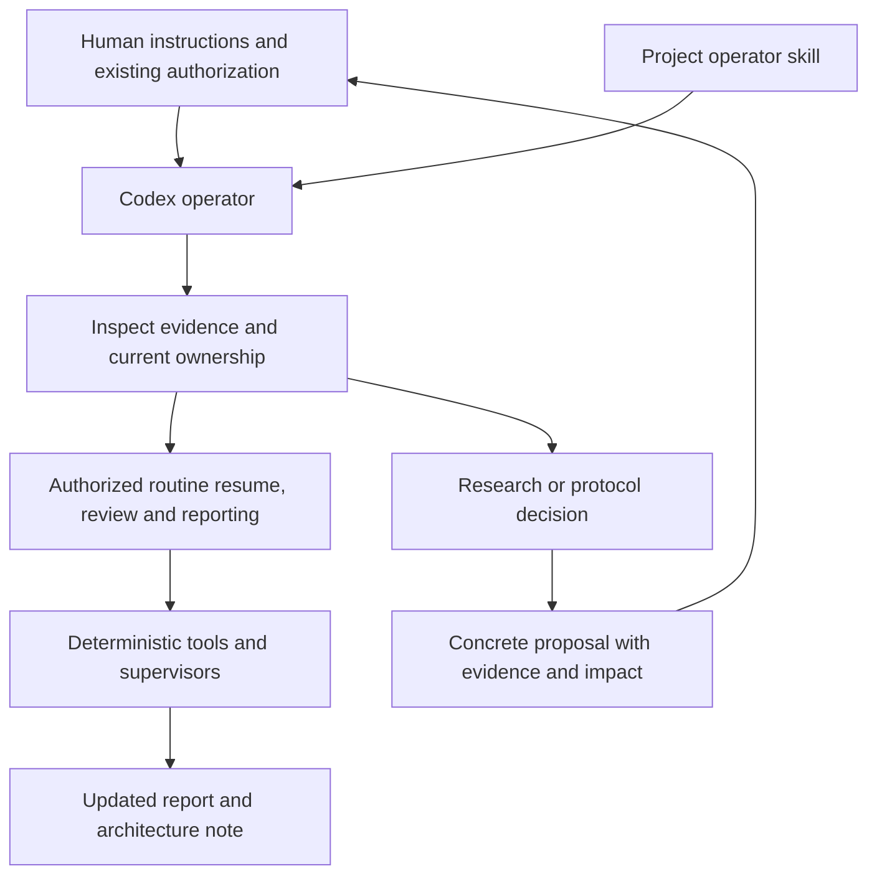
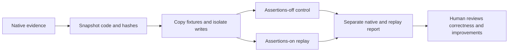

**September 8 v3 amendment:** [Three separate repair stages](experiments/external/post_b2/PIPELINE_V3.md) now define the current design. The running A2/source/README/B2 path is preserved; a separately queued post-B2 source stage is added. Read its method audit before interpreting legacy sections below.

**September 8 implementation review:** [Current pipeline and open correctness findings](AIDEAL_PIPELINE_CODE_REVIEW_2026-09-08.md) qualifies the older guarantees below, including fingerprint completeness, restart budgets and execution isolation. [Visual code guide](AIDEAL_PIPELINE_CODE_REVIEW_2026-09-08.html).

# AIDEAL design logic and automation boundaries

**September 8 protocol update:** the active priority continuation is
[A2-only repair](experiments/external/recovery/PIPELINE_V2.md): A1 remains an
original-README zero-fix control; A2 failures feed source-only snippet recovery
and independent generated-README repair followed by fresh B2. Original-document
repair is omitted. Historical 2×2 descriptions below remain architectural history.

Updated September 7, 2026. This note describes the existing priority study and
labels the new, staged components separately. It is an architecture record,
not evidence that every planned stage has completed.

For component-by-component function links, detailed execution diagrams, prompt
boundaries and the human review state machine, see the
[AIDEAL code and logic guide](AIDEAL_CODE_GUIDE.md).

## Central output: readiness assessment and reviewed improvements

AIDEAL evaluates observed agent usability, explains barriers with evidence,
and supports reviewed improvements. The central entry point is the generated
`AIDEAL_REPORT.md`, linking `data_validation/readiness/ASSESSMENT.md` and a
machine-readable improvement queue. Native 2×2 results remain its experimental
foundation. No composite score is assigned to unmeasured capabilities.

The new report distinguishes discovery, setup/inputs, API execution, workflow
completion, and verification/recovery. Only the current protocol's observed
capabilities are scored. Suggestions have stable IDs and evidence versions;
changed evidence makes old review decisions stale. Human/agent assignment is
recorded but does not launch processes. Acceptance records a reviewer decision,
not an automatically verified improvement or altered baseline score.

`experiments/external/readiness` separates pure assessment, review-state logic,
rendering, and CLI/locking. The current publisher writes a new namespace and
never restarts existing workers or observers. The decision log survives report
refreshes; submitted artifacts are copied by content hash. See the
[review workflow](experiments/external/readiness/WORKFLOW.md) for exact commands
and the distinction between audit actor labels and authenticated authorization.

## End-to-end experiment

Current counts are 148 mir_eval names, 149 Thumbnailator names, and 235 tslearn
names. Definition-site/overload counts are distinct from name denominators.
MDAnalysis full1032 remains behind the priority work; Sedona preparation and
RDPro reruns are deferred. Retained RDPro results are historical evidence,
not a newly matched four-cell study.

The current study uses relevant-document scope, zero snippet-fix rounds in
all final measurements, at most five document-repair rounds per failed API,
and a two-stuck-round stop. B1's configured document treatment is
`original+aideal`; B2's is `aideal`. A fresh B result cannot be assembled from
the union of successful intermediate repair tests.

## Where LLMs, prompts, and deterministic code participate

| Stage | LLM involvement | Main implementation / prompt | Output and boundary |
|---|---|---|---|
| Config loading | None | `grail-agent/src/aideal/config.py`, defaults and language adapters | Direct listed YAML layers are deep-merged in order; nested `extends` is not recursively expanded by the current loader. |
| Public API inventory | Static discovery in these full-surface runs | `readme_agent.py`, public-surface scanner and frozen manifest | Other framework modes can use intent ranking; that optional selection is not the priority full-surface denominator. |
| Documentation generation | Author role | `readme_agent.py`; `default_prompts/aideal/readme_entry.md`, relevant distillation prompt | Source/signature/test evidence informs generated documentation. Generation has its own resumable fingerprint. |
| Comprehension test writing | Audience role | `doc_checks.py`; `default_prompts/aideal/comprehension_write_exec.md` | Selected documentation plus harness/input context produce code. Do not leak independent source-based review into this audience treatment. |
| Compilation/execution | None in the actual compiler/process | Configured Python or Java scaffold and command; `doc_checks.py` | Exit status and success/error/correctness markers determine native execution outcome. Marker presence is not independent oracle validation. |
| Snippet repair | Fixer role is supported by framework | `doc_checks.py`, `llm.py` | Disabled by zero code-fix rounds in final A1/A2/B1/B2 measurements. This differs from document repair. |
| Deep dive and document repair | Configured LLM roles | `deepdive.py`, `docfix.py`; `deep_dive.md`, `docfix_diagnose.md`, `docfix_rewrite.md`, related probe prompt | Source-informed diagnosis and candidate shared-document revisions; failed and reverted rounds must remain recorded. |
| Optional non-execution grading | Author grade supported outside this study | `comprehension_grade.md`, `doc_checks.py` | Not the current executable-study pass criterion. |
| Provider transport | LLM provider call | `llm.py` role routing and shared Google request-start gate | Current priority role mappings use Gemini. SDK-internal retries are not fully observable. |
| Scheduling and resumption | None | `run_condition_watchdog.py`, repository drivers, `run_resumable_readme.py` | Locks, dependency order, retries, atomic promotion, fingerprint-compatible checkpoints. |
| Reporting and passive review | None | `audit_overnight.py`, `audit_experiment_data.py`, `automation/observe.py` | Native outcomes preserved; candidate classifications, AST evidence, config bundles and scoped forecasts are separate. |

Prompt paths above are framework defaults under `grail-agent/src/aideal/`;
project overrides and launch arguments can change effective behavior. Record
effective hashes and commands, not only a prompt's filename. Some framework
prompts also contain dynamically constructed context in Python code.

## Scheduling, retries, and write ownership

The request-start gate spaces application calls; it is not a full token quota
or spend scheduler. Current `max_restarts: 0` means unlimited watchdog retries,
not zero retries. Provider failures cannot satisfy a successful final-result
predicate. An old state saying `running` is not proof that its PID still owns
the job; inspect heartbeat, lock, and process identity.

| Writer | Owned outputs |
|---|---|
| Each condition | Its work directory, checkpoint, generated document, logs, temporary/final result |
| Main report observer | Result ledgers, provenance, status and detailed reports |
| Data observer | `data_validation` evidence files and `FINAL_REPORT_WITH_DATA_CHECKS.md` |
| New passive automation observer | Only `data_validation/automation/` |
| Human/agent documentation edits | Maintained source notes and report appendices, not observer-generated tables |

The data observer's existing recursive deadline copy includes the automation
subdirectory. Live observers continue updating after the cutoff. A copied
report can be partial; scheduling a snapshot does not guarantee valid results.

## Skills and the human in the loop

Skills instruct the conversational operator. They are not injected into the
Gemini audience prompt, do not run as background services, and cannot replace
process locks or validation code. The operator skill supports resume, diagnose,
and report workflows and locates the project from the workspace/user path.

Human involvement is needed for research choices not already authorized:
changing the target question, denominators, model/treatment, scoring policy,
fixture contracts, or budget. Routine actions already covered by the user's
instructions do not require repeated approval. Ambiguous semantic conclusions
remain explicitly uncertain until supported by review; a human reviewer may
accept or reject the interpretation without altering native measured results.

For this session, parallel priority execution and read-only optimization are
authorized. The active protocol remains frozen. New generation prompts and
quota transport integration are staged for a separately versioned protocol.

## New components: implemented versus active

| Component | State | Validation boundary |
|---|---|---|
| Passive forecast/config/failure observer | Can run alongside existing observers in its own namespace | Forecasts cover remaining comprehension only; whole-pipeline ETA remains unknown while generation/repair timing is insufficient. |
| Python assertion review | Offline AST inspection of saved scripts | Finds candidate calls and trivial/missing assertions; does not execute snippets or prove dataflow. Java semantic review remains manual. |
| Input contracts | Tested metadata validator, staged next-protocol example | Explicit shapes/dtypes/units/formats; no claim of complete contracts for all APIs. |
| Shared quota admission | Tested local SQLite reservation core; disabled in `next_protocol.yaml` | Requires provider adapter, actual account limits, token bounds, retry visibility and any spend controls before deployment. No active client is wired to it. |
| Prompt supplements | Versioned proposal only | Requires matched protocol treatment before use in scored runs. |
| Source-informed snippet recovery | Implemented and staged; no live provider/API run | `experiments/external/recovery` compares feedback-only and source-assisted snippet repairs after completed baselines; documents, inputs and headline scores stay fixed. The user accepted threshold two consistently across this study; it is not an optimized finding. |
| Operator skill | Reusable conversational workflow | Uses scripts and evidence; has no autonomous runtime of its own. |

The [recovery extension](experiments/external/recovery/README.md) records its
distinct code-fix loop and historical RDPro evidence. It does not redefine B2:
the current B2 treatment remains documentation repair followed by a fresh
zero-snippet-fix evaluation. Its diagram, protocol YAML, candidate queue and
preflight/runner functions are linked in that note.

## Portability and code structure

New Python modules use standard-library facilities plus the existing AIDEAL
configuration/YAML dependency. They have no embedded user-home or interpreter
paths. The observer takes workspace and report paths as arguments; it is a
current-study adapter using the existing repository specification table.
The quota core, input validator, and pure analysis functions are independent
of repository names. `fcntl` observer locks target Unix systems; the SQLite
quota core is local-machine coordination, not distributed admission.

Existing experiment YAML still contains machine-specific runtime paths. Saved
resolved bundles make those dependencies visible; they do not make historical
runs relocatable by themselves. To move a future study, provision dependencies,
rebase a new config, validate imports/fixtures/output ownership, freeze a new
fingerprint, and preserve the old evidence. Do not silently rebase live cells.

Module responsibilities are small: `analysis.py` calculates forecasts and
triage; `contracts.py` checks input metadata and AST evidence; `quota.py` admits
future transport attempts; `observe.py` reads and writes passive reports.
See [automation usage and limitations](experiments/external/automation/README.md)
and [report data methods](experiments/external/FINAL_REPORT_DATA_AND_API_METHODS.md).

## Authorized isolated assertion replay

The user authorized a secondary Thumbnailator replay while native experiments continue. `experiments/external/assertion_replay/evidence.py` reads and binds retained code; `execute.py` copies fixture bytes and runs assertions-off/on controls in separate writable roots; `report.py` preserves separate native and replay outcomes. `__main__.py` owns locking, assertion/isolation preflight and resumable polling. No LLM is involved.

The replay supervisor owns `thumbnailator_replay_watchdog.v2.state.json`, its own logs and `data_validation/assertion_replay`. The original state preserves a preflight failure before any replay child launched. The active watcher picks up later A1 and final B1/B2 results without changing measured workers or documentation-repair decisions. Its process runs at low CPU priority with one Java child at a time and makes no provider calls.

Assertions-on acceptance does not certify independent oracle validity or the entire documentation-repair pipeline. Historical code-binding gaps, case-insensitive retained-path collisions and fresh-output effects remain explicit. See [the replay method](experiments/external/assertion_replay/README.md).
