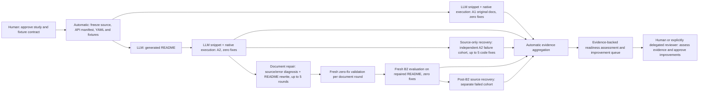

# AIDEAL robustness review and isolated implementation

Date: 2026-09-08, America/Los_Angeles. Branch: `aideal/robust-core-v4`.
Historical reference: `aideal/external-2x2-infra` at `3db92a9`.

The current experiment workers remain on their historical code. This branch
implements and tests the next core revision without changing their treatment,
restarting them, or rewriting their checkpoints. New services are a passive
report reader and a separately recorded tslearn inventory retry using the
unchanged historical v3 engine, each with its own supervisor/output namespace.

## Findings and reviewable changes

| Evidence / barrier | Implemented change | Code reference | Deployment |
|---|---|---|---|
| Old fingerprints omitted actual prompt/profile bytes and transport amendments | Schema 4 binds prompt/profile, effective transport settings, and additional engine files; each API records delivered prompt hashes | `experiment_identity.prompt_contract`, `transport_contract`; `doc_checks._comprehension_fingerprint_components` | Future matched experiments only |
| Fresh B2 journal was invisible without a legacy migration file | Read a published active identity; for old workers, show only the last-observed fingerprint group with an explicit provisional label | `provider_retry.evidence.collect` | Separate passive observer |
| Document rounds could reset after a restart | Durable per-API phase journal, original entry, round history, saved diagnosis/rewrite/validation results, and phase attempt timing | `repair_journal.RepairJournal`; `doc_repair.run` | Future runs only |
| Multiple document repair callers could write the same README | Nonblocking file lock around the public document-repair entry point | `repair_journal.document_lock`; `docfix.doc_fix_run` | Future callers using this entry point |
| Shell timeout could leave a child running | Dedicated POSIX process group, bounded cleanup, and a persistent execution block when cleanup cannot be confirmed | `execution.run_command` | Future runs; real group termination still needs host validation |
| Two callers could share a native checkpoint/test directory | Exclusive writer lock for the native evaluation; cleanup blocks are checked before model work | `execution.exclusive_work_dir` | Future runs only |
| Corrupt transport JSON could bypass installation | Intended worker bootstrap fails before CLI execution; unrelated plain Python is unaffected | `provider_retry.enroll.BOOTSTRAP` | Future explicit enrollment only |
| Invalid imported API symbols were classified as infrastructure failures | `ImportError: cannot import name` gets a separate `api-import` category | `doc_checks._classify_error_py` | Future native measurements; historical categories unchanged |
| Corrupt supervisor state could be read as an empty fresh plan | Reject malformed/invalid persisted state before adoption, saving, or launching | `run_condition_watchdog.Supervisor.__init__` | New passive supervisor; live supervisors unchanged |

## Before / after module responsibilities

| Responsibility | Historical implementation | This branch |
|---|---|---|
| Document editing helpers and public entry | `docfix.py`, 707 lines including loop | `docfix.py`, 333 lines; public signature retained |
| Document repair orchestration | Same file | `doc_repair.py`, 444 lines |
| Durable phase state and exclusive README access | No separate component | `repair_journal.py`, 122 lines |
| Local subprocess lifecycle and native writer lock | Inline `subprocess.run` | `execution.py`, 86 lines |
| Prompt and transport identity | Incomplete inline identity | `experiment_identity.py`, 56 lines |
| Fresh native evidence reader | Required legacy compatibility receipt | `provider_retry/evidence.py`, 86 lines |

This is a responsibility split, not a claim of fewer total lines. The orchestration
function is still substantial. Further extraction should follow the stable phase
boundaries after this study, with the current resume tests retained. Core paths
are derived from configuration; the study-specific watchdog YAML still names its
installed interpreter and workspace. POSIX locks/process groups require a platform
adapter for Windows. No new third-party runtime dependency was added.

## Full experiment boundaries and actors



The diagram is a stage map; the document controller iterates while its round
budget and stagnation policy permit. Source-only recovery and document repair
start independently from A2; source snippets are not fed into B2 audience tests.
There is no original-README repair/B1 arm in this study. `stuck_rounds: 2` is
unchanged. Provider retries are not new document proposals or code-fix rounds.
LLM diagnosis/rewrite/deep-dive prompts remain in `grail-agent/src/aideal/default_prompts/aideal/`;
project overrides and the effective YAML profile are hashed in the new identity.

Automatic behavior includes admission, execution, checkpointing, retry scheduling,
and reports. The operator skill guides the assistant's operations; it is not a
runtime skill automatically executed by the harness. Human review is needed for
study changes and acceptance of proposed code/document improvements. An interrupted
phase with no completion receipt requires evidence reconciliation; a delegate can
inspect it, but the controller must not silently declare it completed or redo it.

## Resumption contract

1. A README lock protects participating document-repair callers.
2. Schema 4 repair identity binds configuration, source/tests, prompt/profile,
   baseline result when supplied, engine, policy and transport.
3. The original entry and phase `started` receipt are durable before model work.
4. Completed phases are reused. A known failed validation retries validation
   without another diagnosis/rewrite or another logical document round.
5. Round history and stagnation state survive restart. Terminal failure restores
   the original entry. A per-entry validation pass does not guarantee a fresh B2 pass.
6. An ambiguous interrupted invocation or unconfirmed process cleanup blocks
   automatic re-execution. Reconciliation tooling remains a follow-up item.

Per-phase journal attempts now contain start/end epochs, elapsed time, and time
since the previous attempt ended. The historical study lacks some of those fields;
reports keep missing values explicit rather than inventing zero durations.

## Current output ownership and configuration evidence

The read-only `experiments.external.code_review.ownership` helper inspects discovered
watchdog plans/states and process presence. Unlike the existing static per-cell
automation bundles, this snapshot focuses on currently declared supervisor writers.
It imports no provider, sends no requests, and signals no processes.

The 16:29 PDT snapshot found 10 states declaring a running job, with no overlapping
declared output paths. Nine recorded PIDs were present; the historical
`rdpro_complete_2x2` PID was absent. The idle/deferred MDAnalysis and RDPro waiters
were preserved. Process presence alone does not establish activity or identity.

The three active native API workers use separate worktrees, execution directories,
outputs and result files. Their configured mir_eval text/label fixtures and
tslearn Trace NPZ fixture exist. That does not certify that every generated snippet
uses the right input, reaches its target, or has a correct oracle. tslearn B2 logs
still show missing optional imports such as `keras`; these remain native outcomes.

Discovered plans/defaults share `/tmp/aideal_google_rate_gate.txt` with a three-second
minimum admission interval. `llm._wait_for_provider_slot` serializes admissions;
`post_b2.admission.slot` reserves native capacity and serializes recovery admissions.
This is not a verified account-wide requests/tokens/concurrency limit. Inherited
worker environment and other machines are not attested by the YAML snapshot.
No quota settings or measured worker transports were changed by this branch.

## Validation and migration gate

The expanded offline suite passed **182 tests, with 1 skipped**. It includes all
`grail-agent/tests`, recovery, post-B2, provider-retry, supervisor and adoption tests.
Tests cover saved validation reuse, lifetime round budget/original entry, ambiguous
phase refusal, prompt/profile/transport drift, bootstrap failure, fresh checkpoint
groups, corrupt state, process cleanup call order and persistent cleanup blocking.
No model calls or measured API experiments were launched by these tests.

The real disposable-child process-group termination test is skipped because this
execution environment denies `os.killpg`, including an escalated attempt. Mocked
signal/cleanup tests pass; host-level descendant termination is **not certified**.

Historical post-B2 registration remains frozen. Its implementation hash check
intentionally rejects this changed source-recovery implementation. Do not update
that receipt to disguise a v4 run as v3. Deploying a new matched study requires a
new protocol registration, fresh compatible A2/B2 identities, a defined `api-import`
recovery cohort, and host process-cleanup validation. Existing v3 controllers keep
running from their original worktree. No pre-existing experiment job was
restarted or deleted. The newly created inventory-retry service was replaced
with user-approved network-enabled execution after sandbox connection failures;
its state and failed-request evidence were retained.

## Operational correction after B2 completion

At 16:49 PDT, tslearn B2 finished with **217/235 native passes**, 13 setup/import
failures and 5 execution failures. Post-B2 recovery initially recorded all five
eligible cases as `preflight_blocked`: its inventory search omitted the full235
freeze worktree. No code-fix proposal was made in those blocked cases.

The existing `environment_freeze.txt` has SHA-256
`7ca2807ace989a2abd86169a3f038cdb7370f04a9ec38930e8478222ff596c60`, exactly matching
the B2 runtime fingerprint. Supplying it through the existing
`AIDEAL_RECOVERY_ENV_INVENTORY` setting passed runtime/import and source-treatment
preflight for `TimeSeriesMixin`, `extract_from_zip_url`, `is_float`, `is_float32`
and `is_float64` without model calls.

`post_b2_inventory_retry_watchdog.yaml` now runs the unchanged registered v3
controller with that explicit inventory. The original `pipeline_v3` output is
preserved. `pipeline_v3_inventory_retry` retains compatible completed mir_eval
and Thumbnailator evidence and retries only those five tslearn cases. The
shared Gemini admission lock/rate file and five-round/two-stagnant-round policy
remain unchanged. Initial sandbox connection failures and the authorized
network-enabled replacement are operational attempts, not new code-fix rounds.

The retry report is `data_validation/pipeline_v3_inventory_retry/REPORT.html`.
The native status observer continues to show the original post-B2 block separately;
consult this retry report for the corrected continuation. It must not be silently
substituted for the historical blocked result in the final paper/report.

## Improvement queue requiring further evidence

| Priority | Item | Acceptance evidence |
|---|---|---|
| High | Validate process-group cleanup on the actual execution host | Real child/grandchild termination and no late file writes |
| High | Register a matched next experiment before enabling the new core | New protocol identity and matched A2/B2 input/prompt/transport contracts |
| High | Resolve optional dependency vs invalid-import categories | Isolated import checks; preserve historical native outcomes |
| High | Add independent per-API semantic oracles and target/dataflow witnesses | Fixture schema checks, target invocation evidence, reference/metamorphic assertions |
| Medium | Review interrupted-phase reconciliation workflow | Saved response/process evidence, explicit decision, no silent duplicate proposal |
| Medium | Complete account-wide Gemini admission integration | Every SDK attempt reserves the same request/token/concurrency policy |
| Medium | Further split document controller | Smaller phase functions with unchanged resume and budget tests |
| Later | Consolidate worktrees | Branch unique commits, artifact owners, active job references and archive manifest reviewed first |

## Artifacts and reproducibility

- Existing atlas: `/Users/clockorangezoe/output/archify-geoai/index.html` (unchanged).
- New interactive phase diagram: `/Users/clockorangezoe/output/archify-geoai/robustness-v4/document-recovery.html`.
- Diagram JSON and Archify visual-check receipts are beside that HTML.
- Ownership snapshot: `/Users/clockorangezoe/output/aideal-robustness-v4/ownership.json`.
- Passive report: sibling audit worktree, `data_validation/provider_operations_v4/REPORT.html`.
- Its supervisor plan: `experiments/external/provider_operations_v4_watchdog.yaml`.

Archify validation passed 9/9 showcase checks, zero errors/warnings. Browser
containment/readability checks passed at the requested desktop sizes, and light/dark
1440×900 captures were visually reviewed. This certifies the diagram checks only;
the code test results and remaining limitations are reported separately above.

Run the targeted suite from this worktree using the configured environment:

```sh
env PYTHONPATH=grail-agent/src:. python -m pytest -q grail-agent/tests \
  experiments/external/recovery experiments/external/post_b2 \
  experiments/external/provider_retry experiments/external/test_run_condition_watchdog.py \
  experiments/external/test_watchdog_adoption.py experiments/external/test_watchdog_corruption.py
```
