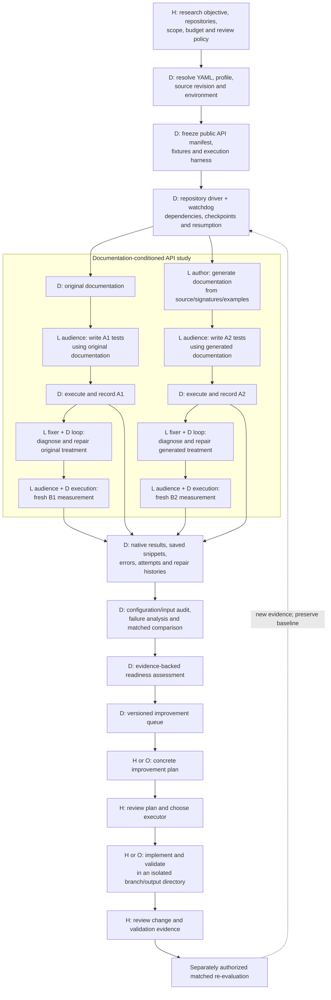
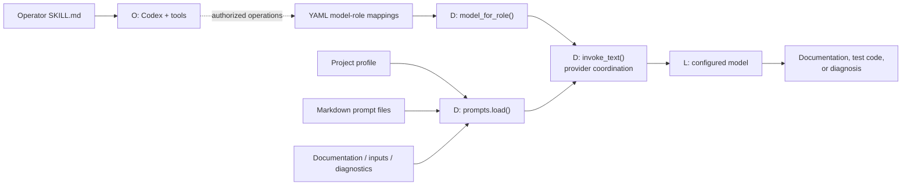
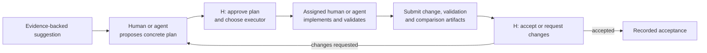

# Verbatim memo of the preceding assistant answer

Recorded September 7, 2026 at the user's request. The text below preserves the preceding answer, including its diagrams, links and qualifications. It is a historical memo; subsequent literature findings are recorded separately.

---

I saved the detailed [AIDEAL design and code guide](/Users/clockorangezoe/Documents/phd_projects/code/geoAI/GRAIL_rdpro_puzzle_aideal/AIDEAL_CODE_GUIDE.md), containing **six diagrams and 104 checked file/function links**. It is also included in the final-report directory. Both documentation commits are pushed; running jobs were untouched.

AIDEAL now has two connected responsibilities: **measure agent usability with executable evidence**, then **turn observed barriers into improvements that humans can review**.

**Diagram legend**

- **D — deterministic automation:** runs without an LLM.
- **L — LLM:** generates documentation, tests, or diagnosis.
- **O — operator agent:** Codex or another agent using tools.
- **H — human:** defines objectives, approves improvements, reviews evidence.

The experiment section can run autonomously under the existing authorization. The improvement section currently **records proposals, decisions and evidence**; it does not launch an implementation agent or merge changes.

The main component references are:

| Component | Code/function to inspect | Execution |
|---|---|---|
| YAML loading and overrides | [`config.load_config()`](/Users/clockorangezoe/Documents/phd_projects/code/geoAI/GRAIL_rdpro_puzzle_aideal/grail-agent/src/aideal/config.py:201) | D |
| Project goals and constraints | [`profile.require_profile()`](/Users/clockorangezoe/Documents/phd_projects/code/geoAI/GRAIL_rdpro_puzzle_aideal/grail-agent/src/aideal/profile.py:67) | H defines; D validates fields |
| Public API discovery | [`readme_agent.public_api_surface()`](/Users/clockorangezoe/Documents/phd_projects/code/geoAI/GRAIL_rdpro_puzzle_aideal/grail-agent/src/aideal/readme_agent.py:1173), [`public_api_details()`](/Users/clockorangezoe/Documents/phd_projects/code/geoAI/GRAIL_rdpro_puzzle_aideal/grail-agent/src/aideal/readme_agent.py:2070) | D in current full-surface runs |
| Documentation generation | [`readme_agent.find_or_create()`](/Users/clockorangezoe/Documents/phd_projects/code/geoAI/GRAIL_rdpro_puzzle_aideal/grail-agent/src/aideal/readme_agent.py:2375) | D orchestration + L author |
| Input/fixture resolution | [`doc_checks._execute_sample_data()`](/Users/clockorangezoe/Documents/phd_projects/code/geoAI/GRAIL_rdpro_puzzle_aideal/grail-agent/src/aideal/doc_checks.py:845) | D |
| Test writing and execution | [`doc_checks._comprehension_execute()`](/Users/clockorangezoe/Documents/phd_projects/code/geoAI/GRAIL_rdpro_puzzle_aideal/grail-agent/src/aideal/doc_checks.py:1056) | L audience writes; D executes |
| Compatible checkpoint reuse | [`_checkpoint_row_reusable()`](/Users/clockorangezoe/Documents/phd_projects/code/geoAI/GRAIL_rdpro_puzzle_aideal/grail-agent/src/aideal/doc_checks.py:115) | D |
| Source-informed diagnosis | [`deepdive.deep_dive_run()`](/Users/clockorangezoe/Documents/phd_projects/code/geoAI/GRAIL_rdpro_puzzle_aideal/grail-agent/src/aideal/deepdive.py:61) | L fixer, with D context collection |
| Document repair and retesting | [`docfix.doc_fix_run()`](/Users/clockorangezoe/Documents/phd_projects/code/geoAI/GRAIL_rdpro_puzzle_aideal/grail-agent/src/aideal/docfix.py:315) | Autonomous L + D loop |
| Four-cell experiment jobs | [`run_external_2x2_pipeline.make_job()`](/Users/clockorangezoe/Documents/phd_projects/code/geoAI/GRAIL_rdpro_puzzle_aideal/experiments/external/run_external_2x2_pipeline.py:179) | D |
| Scheduling and resumption | [`Supervisor.run()`](/Users/clockorangezoe/Documents/phd_projects/code/geoAI/GRAIL_rdpro_puzzle_aideal/experiments/external/run_condition_watchdog.py:264) | D |
| Failure/attempt/repair ledger | [`audit_overnight.summarize()`](/Users/clockorangezoe/Documents/phd_projects/code/geoAI/GRAIL_rdpro_puzzle_aideal/experiments/external/audit_overnight.py:103) | D |
| Actual data and snippet audit | [`audit_experiment_data.inspect()`](/Users/clockorangezoe/Documents/phd_projects/code/geoAI/GRAIL_rdpro_puzzle_aideal/experiments/external/audit_experiment_data.py:97) | D |
| Effective configuration evidence | [`automation.observe.bundle()`](/Users/clockorangezoe/Documents/phd_projects/code/geoAI/GRAIL_rdpro_puzzle_aideal/experiments/external/automation/observe.py:45) | D |
| Readiness assessment | [`readiness.model.assess()`](/Users/clockorangezoe/Documents/phd_projects/code/geoAI/GRAIL_rdpro_puzzle_aideal/experiments/external/readiness/model.py:13) | D |
| Evidence-backed suggestion | [`readiness.model.suggestion()`](/Users/clockorangezoe/Documents/phd_projects/code/geoAI/GRAIL_rdpro_puzzle_aideal/experiments/external/readiness/model.py:69) | D; no automatic patch |
| Human review rules | [`readiness.review.validate()`](/Users/clockorangezoe/Documents/phd_projects/code/geoAI/GRAIL_rdpro_puzzle_aideal/experiments/external/readiness/review.py:42) | D checks recorded H/O decisions |
| Final assessment and cards | [`readiness.report.publish()`](/Users/clockorangezoe/Documents/phd_projects/code/geoAI/GRAIL_rdpro_puzzle_aideal/experiments/external/readiness/report.py:81) | D |

The tslearn-specific driver is [`run_full235_pipeline.py`](/Users/clockorangezoe/Documents/phd_projects/code/geoAI/GRAIL_tslearn_full235_freeze/experiments/tslearn/run_full235_pipeline.py:292) in its sibling worktree.

**Where LLM calls happen**

| Role | Main prompts | Purpose |
|---|---|---|
| Author | [`readme_entry.md`](/Users/clockorangezoe/Documents/phd_projects/code/geoAI/GRAIL_rdpro_puzzle_aideal/grail-agent/src/aideal/default_prompts/aideal/readme_entry.md), [`readme_distill.md`](/Users/clockorangezoe/Documents/phd_projects/code/geoAI/GRAIL_rdpro_puzzle_aideal/grail-agent/src/aideal/default_prompts/aideal/readme_distill.md) | Generate source-grounded documentation |
| Audience | [`comprehension_write_exec.md`](/Users/clockorangezoe/Documents/phd_projects/code/geoAI/GRAIL_rdpro_puzzle_aideal/grail-agent/src/aideal/default_prompts/aideal/comprehension_write_exec.md) | Write executable tests from the selected documentation and harness context |
| Fixer | [`deep_dive.md`](/Users/clockorangezoe/Documents/phd_projects/code/geoAI/GRAIL_rdpro_puzzle_aideal/grail-agent/src/aideal/default_prompts/aideal/deep_dive.md), [`docfix_diagnose.md`](/Users/clockorangezoe/Documents/phd_projects/code/geoAI/GRAIL_rdpro_puzzle_aideal/grail-agent/src/aideal/default_prompts/aideal/docfix_diagnose.md), [`docfix_rewrite.md`](/Users/clockorangezoe/Documents/phd_projects/code/geoAI/GRAIL_rdpro_puzzle_aideal/grail-agent/src/aideal/default_prompts/aideal/docfix_rewrite.md) | Investigate failures and repair documentation |
| Operator agent | [`aideal-experiment-operator/SKILL.md`](/Users/clockorangezoe/Documents/phd_projects/code/geoAI/GRAIL_rdpro_puzzle_aideal/.agents/skills/aideal-experiment-operator/SKILL.md) | Inspect jobs, diagnose evidence, maintain authorized automation and prepare proposals |

Author, audience and fixer are **logical roles**; they can use the same underlying Gemini model. The operator skill guides Codex separately and is not a Gemini experiment prompt.

Configuration therefore spans YAML, profile, prompt files, source, manifest, fixtures, scaffold, dependencies and environment—not just one YAML file.

**Where human involvement is required**

Human review controls the research objective, improvement approval, executor choice and acceptance of submitted evidence. Routine authorized experiment generation, execution, retries and document-repair treatments continue automatically.

Two implementation limits matter:

- Review records require a human actor label for approval and acceptance, but labels are self-reported; this is an audit workflow, not authenticated access control.
- A passing test currently means execution and configured witness checks passed. It does not independently certify input suitability or assertion correctness.

The guide also maps optional puzzle evaluation, memory, aliases and MCP tools, and labels the new quota/input-contract extensions as staged. My assessment is that AIDEAL has a useful executable measurement foundation and a clear review loop; independent semantic validation and broader discovery/setup/workflow measurements are the main remaining gaps.
