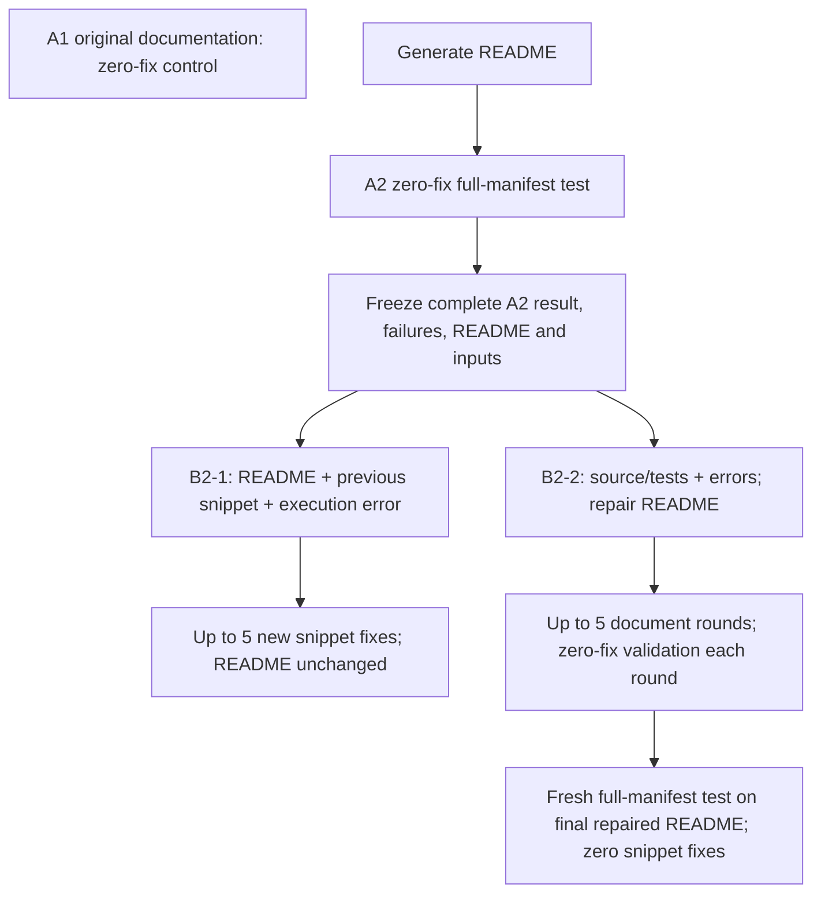

# Agreed main study: independent repairs from frozen A2 failures

Registered September 8, 2026, after the user's review of existing outcomes.
This is a disclosed protocol amendment, not retrospective preregistration.

**Scheduling amendment, September 8 at 22:40 PDT:** [RDPro before remaining
MDAnalysis stages](../RDPRO_FIRST_2026-09-08.md). Current MDAnalysis A1/generation
continue; new MDAnalysis launches wait until RDPro v5 finishes. Existing tslearn
B2-1 and RDPro workers are preserved.

Reports use [the v5 template](REPORT_TEMPLATE_V5.md), including a required comparison
of each original README's style, examples and data guidance with the A1 bundle,
A2 generated document and repaired document. This descriptive audit does not
change experiment inputs or establish a causal style effect.

B2-1 and B2-2 receive the same original A2 failure cohort, never one another's
results. Five means five *new* snippet fixes after retained A2 round zero.
Both loops retain the accepted stuck threshold of two. A persisting infrastructure
failure can stop snippet recovery early; it remains in the fixed denominator.
Historical S_A2 source recovery and S_B2 post-recovery are supplementary arms.
Historical B1 original-document repair remains excluded.

## Reuse and rerun decisions

| Evidence | Decision | Why |
|---|---|---|
| Priority A1 | Continue unfinished provider retries; preserve passes | Independent original-document control is unchanged |
| Priority A2 | Reuse completed 148/149/235-API baselines | Existing zero-fix full-manifest results and fingerprints checked |
| B2-1 feedback only | New 13/22/60-case continuation | Old S_A2 used source/tests and excluded some failures |
| Priority B2-2 | Reuse as historical native treatment evidence | Exact inherited A2, all original failure targets, deep-dive-first, 5 doc rounds, zero snippet validation |
| Fresh test after B2-2 | Reuse native B2 | Full manifest, zero fixes, matching non-document contracts under recorded migrations |
| MDAnalysis | Preserve ongoing v4 A1/A2 and queued document branch; add B2-1 after its A2 finishes | No baseline restart or duplicate generation |
| RDPro | Preserve historical evidence; new registered 161-API study queued separately | New matched A2 and both repair branches; no A1 rerun; see `../rdpro_v5/README.md` in the RDPro main-v5 worktree |

`REUSE_AUDIT_2026-09-08.json` records checks, migrations, hashes and limitations.
No completed snippet is inserted into a native baseline. Structural reuse does
not certify semantic validity. A clean matched-harness claim requires rerunning
affected baselines **and document-repair decisions**, not merely replaying the
last B2 snippets. Thumbnailator's native assertions and shared-output dependence
are known limitations. Legacy document budgets are per invocation and do not
establish a five-round lifetime cap across historical restarts. Missing packages,
skipped calls and generated oracles retain separate evidence labels.

## RDPro alignment

RDPro's historical A2 fix5 runs resemble B2-1's feedback mechanism but make
their own round-zero attempts: 16 shared-88 and 6 complement-83 outcomes differ
from the separately saved A2. They cannot count as continuation of frozen A2.
The completed document run targets the original 98 A2 failures, retains 67
entries, and uses deep-dive-first / five document rounds / zero snippet retries.
The subsequent fresh result records 132/171 native passes with zero fixes.
That is the same broad B2-2 → fresh-evaluation logic, not identical engine or
data conditions. Its 171 entries include ten extras outside the validated 161;
do not silently substitute this artifact denominator for the public surface.

## Implementation and output ownership

* `audit.py`: inspect existing structural compatibility and historical RDPro.
* `worker.py`: freeze physical copies, preflight all failures, then invoke the
  existing recovery adapter in **feedback** mode. One outcome per API, with
  separate provider events, rounds, exact code, errors and timestamps.
* `protocol.yaml`: accepted budgets, cohort, input boundaries and limitations.
* `report.py`: separate passive report; no model calls or experiment mutations.
* `../main_plan_watchdog.yaml`: separate supervisor. The supervisor’s same-working-directory guard serializes the new B2-1 workers;
  existing A1 and MDAnalysis workers remain parallel. The shared supplemental
  lock additionally excludes overlap with legacy source recovery. MDAnalysis
  feedback runs after priority feedback and its own complete A2.

Priority workers load the preserved main schema-3 engine; MDAnalysis loads its
own pinned schema-4 engine. The new operator modules do not modify either core.
Feedback mode uses no new source/test diagnosis; deterministic inventory and
input checks still inspect source locally, and the generated README itself is
source-derived. RDPro's existing Scala receiver hints are an additional historical
context difference. This is not an equal-cost source-access-only ablation.

Private copies: workspace parent `/AIDEAL_main_plan_v5/<repo>/`.
Report evidence: audit `data_validation/main_plan_v5/<repo>/`.
The live observer owns only `main_plan_v5/live/`; the original plan also has a
later passive report in the distinct `main_plan_v5/report/` namespace.
`main_plan_live_watchdog.yaml` keeps live reporting independent of the paid queue.
Existing Gemini gate and 300-second/two-attempt transport settings are retained.
One shared supplemental lock prevents overlap with legacy supplemental recovery;
three reserved priority slots + two MDAnalysis slots + one supplement give the
existing six-caller local envelope. The start gate is not a token quota guarantee.

Run preflight without `--execute`; exact arguments are in the watchdog YAML.
Tests: `python -m pytest experiments/external/main_plan
experiments/external/recovery/test_recovery.py -q`.
