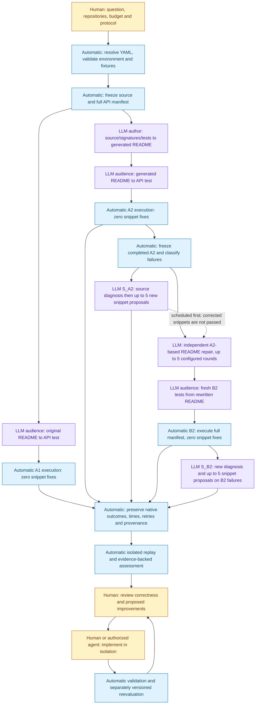

# AIDEAL: implementation review and current pipeline

Reviewed September 8, 2026, approximately 16:08 PDT. This document describes the
current separated-stage study, superseding older four-cell diagrams for current
execution. It does not change the measured protocol or any running worker.

**Verdict:** the main stage separation is implemented and running, with useful
checkpoint, isolation and provenance checks. It is not yet a fully robust,
portable experiment framework. The review found specific gaps below. Passing
tests alone did not reveal all of them.

The offline suite passed **86 tests in 1.98 seconds**. Seven additional isolated
probes reproduced failure modes without calling Gemini or running repository API
experiments. [Probe code](https://github.com/ZhuochengShang/GRAIL/blob/3db92a919b74cd3e822132f83f3a3aa9a1fb95a9/experiments/external/code_review/checks.py) ·
[Probe results](https://github.com/ZhuochengShang/GRAIL/blob/3db92a919b74cd3e822132f83f3a3aa9a1fb95a9/experiments/external/code_review/evidence_20260908.json).

## 1. Findings, in priority order

### R1 — High: checkpoint identity omits delivered prompt/profile inputs

[_comprehension_fingerprint_components](https://github.com/ZhuochengShang/GRAIL/blob/3db92a919b74cd3e822132f83f3a3aa9a1fb95a9/grail-agent/src/aideal/doc_checks.py#L62)
hashes the Python prompt loader, source, fixtures, scaffold, document and execution
settings, but not the actual prompt Markdown or project-profile contents loaded
by [prompts.load](https://github.com/ZhuochengShang/GRAIL/blob/3db92a919b74cd3e822132f83f3a3aa9a1fb95a9/grail-agent/src/aideal/prompts.py#L29). The transport/setup
amendment is also outside the historical native identity, and
[matched](https://github.com/ZhuochengShang/GRAIL/blob/3db92a919b74cd3e822132f83f3a3aa9a1fb95a9/experiments/external/post_b2/evidence.py#L32) does not enforce it.

**Reproduced:** changing the temporary prompt or profile changed rendered model
input while leaving the native fingerprint unchanged. A synthetic A2/B2 pair
with different extra transport metadata still passed the matching gate.

The current A2/B2 prompt and profile files match within all three repositories;
[resolved paths and hashes](https://github.com/ZhuochengShang/GRAIL/blob/3db92a919b74cd3e822132f83f3a3aa9a1fb95a9/experiments/external/code_review/current_prompt_profile_identity.json)
record that limited consistency check. It is not a historical request transcript.

**Impact:** the code does not enforce the claim that every material treatment
change invalidates reuse. Current worktree consistency is useful evidence, but
cannot replace historical request identity. The actual study intentionally mixes
historical and newly instrumented provider retries; that amendment must remain
visible, and transport-recovered cases must be analyzed separately.

**Correction for a new schema:** bind resolved prompt files, profile bytes,
effective generation/transport/setup policy and per-request rendered prompt
hashes. Explicitly permit only registered A2-to-B2 differences. Do not silently
upgrade or invalidate the checkpoints currently being used.

### R2 — High: a test timeout does not guarantee child-process cleanup

[_comprehension_execute](https://github.com/ZhuochengShang/GRAIL/blob/3db92a919b74cd3e822132f83f3a3aa9a1fb95a9/grail-agent/src/aideal/doc_checks.py#L1455) invokes a shell
with `subprocess.run(..., shell=True, timeout=...)`. Timing out kills the immediate
process; it does not guarantee termination of descendants. A bounded toy child
continued and wrote its temporary marker after the shell timed out.

**Impact:** a timed-out generated program can continue consuming resources or
writing after the harness moves to the next API. This is a demonstrated runner
failure mode, not evidence that a current experiment child is orphaned.

**Correction:** own a process group/session per API, terminate and reap its tree
on timeout, and record cleanup evidence. Validate with a child-spawning test in
an isolated runner revision before enrolling future measured work.

### R3 — Medium: fresh B2 progress is hidden by the report reader

[collect](https://github.com/ZhuochengShang/GRAIL/blob/3db92a919b74cd3e822132f83f3a3aa9a1fb95a9/experiments/external/assertion_replay/evidence.py#L20) requires a
`checkpoint_compatibility.json` when no final JSON exists. A fresh run normally
does not need that legacy migration file. [publish](https://github.com/ZhuochengShang/GRAIL/blob/3db92a919b74cd3e822132f83f3a3aa9a1fb95a9/experiments/external/provider_retry/report.py#L72)
then labels absent collected evidence as “Not started / no native results.”

**Observed:** tslearn B2 started at 16:00:06 and had 21 checkpoint outcomes at
16:04, while the new dashboard said “Not started.” Native execution is proceeding;
the dashboard state is wrong. Never use that label alone as execution evidence.

**Correction:** distinguish not started, active before first result, active with
fresh checkpoints, incompatible evidence, and final results. Read fresh journals
under a verified run identity without requiring a migration proof. Keep raw
provisional progress separate if full identity is not yet available.

### R4 — Medium: generated invalid imports are classified as infrastructure

[_classify_error_py](https://github.com/ZhuochengShang/GRAIL/blob/3db92a919b74cd3e822132f83f3a3aa9a1fb95a9/grail-agent/src/aideal/doc_checks.py#L902) maps any ImportError
or ModuleNotFoundError to `infra`. [eligible](https://github.com/ZhuochengShang/GRAIL/blob/3db92a919b74cd3e822132f83f3a3aa9a1fb95a9/experiments/external/recovery/validation.py#L36)
excludes `infra` from source recovery. The real tslearn `jacobian_product` example
imports unavailable `squared_distance_profile` from an installed target module.

**Impact:** 32/32 source recoveries do not mean all 60 A2 failures were repaired.
The 28 import/setup-classified cases are outside that cohort; some can be generated
API-name mistakes rather than environment defects. Full-manifest scores retain
them, but the recovery denominator is a conditional selection.

**Correction:** preserve native categories, add reviewed root-cause labels and
verify installed package/target ownership before blaming setup. Register a new
expanded cohort if these cases are later admitted; do not change this cohort
retroactively.

### R5 — Medium: document rounds are not a lifetime budget across restarts

[doc_fix_run](https://github.com/ZhuochengShang/GRAIL/blob/3db92a919b74cd3e822132f83f3a3aa9a1fb95a9/grail-agent/src/aideal/docfix.py#L440) retries unfinished APIs, then
reinitializes `rounds_trail`, stagnation and the `range(doc_rounds)` loop. It can
treat the document left on disk as its restart baseline. Source recovery has a
stronger persisted round history in [recover](https://github.com/ZhuochengShang/GRAIL/blob/3db92a919b74cd3e822132f83f3a3aa9a1fb95a9/experiments/external/recovery/engine.py#L27).

**Impact:** five document rounds means five per invocation, not a proven lifetime
maximum of five distinct rewrite/validation rounds. Restart logs can contain
attempts missing from the final per-API summary. The append-log audit found no API
with more than five recorded round starts in the current three B2 runs at review
time; the restart failure mode nevertheless exists in the implementation.

**Correction:** persist original entry, current draft, completed rounds, stopping
state, and unfinished phase before continuing. Keep attempt and round IDs separate.
This changes measured recovery behavior and needs a registered revision.

### R6 — Medium: malformed bootstrap policy fails open

The JSON parse and config selection in [BOOTSTRAP](https://github.com/ZhuochengShang/GRAIL/blob/3db92a919b74cd3e822132f83f3a3aa9a1fb95a9/experiments/external/provider_retry/enroll.py#L15)
occur before its fail-closed `try`. Python reports a sitecustomize exception and
continues startup. The isolated malformed-policy probe exited zero and executed
the test CLI body without activating the adapter.

**Impact:** corrupt policy can silently remove expected retry telemetry/settings.
No corruption was observed in the installed policies. Atomic writes reduce the
likelihood, but do not provide the missing failure behavior.

**Correction:** validate policy parsing/schema and activation as one guarded
bootstrap operation; fail clearly for intended enrolled invocations. Preserve
normal unrelated Python startup. Test missing, malformed and tampered policies.

### Design limits that remain explicit

- Native acceptance checks process exit and marker strings. It does not prove
  the target API was reached or that the model's assertion is meaningful.
- Worktree and path isolation are ownership controls, not an OS sandbox around
  generated code. The test process inherits the configured environment.
- Review actors are locally declared labels, not authenticated identities.
  The review queue is a local workflow, not an access-control system.
- The core still has large modules: `readme_agent.py` 2,776 lines,
  `doc_checks.py` 1,878 and `docfix.py` 707 at this snapshot. The newer recovery,
  transport and reporting modules are separated by responsibility. A portable
  product still needs a gradual core split and removal of machine-specific YAML.

| Review dimension | Assessment |
|---|---|
| Correctness | Main pipeline matches the intended treatments; the six findings require correction or explicit qualification. |
| Security/isolation | Local trusted-workspace execution; output ownership checks are useful but not process containment or authenticated approval. |
| Performance | Bounded recovery proposals, checkpoint reuse and shared admission help; provider latency and cleanup gaps remain. No load benchmark was performed. |
| Maintainability | New modules are reasonably small; old core modules, versioned worktree copies and absolute runtime paths still need cleanup. |

## 2. Full pipeline: evidence flow versus scheduling



The dotted edge is scheduling only. Both repair treatments start from A2 evidence;
the README worker does not receive S_A2's successful tests or diagnosis.

**Actual scheduling:** each repository's driver adopts A1/A2 workers, waits only
for its A2, runs its first S_A2 batch, then README repair and fresh B2. A1 can keep
running concurrently. The supplemental scheduler admits each ready repository's
S_B2 and residual S_A2 provider retries independently of unrelated repositories.
The implementation additionally verifies that the initial S_A2 pass has no
pending/running rows before admitting S_B2. There is no B1 treatment.

## 3. What each stage measures

| Stage | What the LLM sees | What it may change | Budget and result |
|---|---|---|---|
| A1 | Original relevant docs, profile, receiver/input/harness context | New test snippet | One generation attempt per successful provider invocation; zero snippet fixes; native pass/fail on full manifest. |
| README generation | Source/signatures, relevant original docs and extracted test evidence | Generated README entries | Generation checkpoint protocol; separate from the five-round recovery budget. |
| A2 | Generated relevant docs plus the same kind of harness context | New test snippet | Zero snippet fixes; all manifest names retained. |
| S_A2 | Frozen failing A2 snippet/error, generated docs, source-grounded diagnosis | Test snippet only | A2 is round zero, then at most five new proposals; eligible failure cohort only. |
| README repair | A2-selected failure evidence, source/types/call sites, current document draft | Generated README entry | Deep dive, diagnosis, rewrite, then zero-snippet-fix validation; five configured rounds per invocation. |
| B2 | Rewritten relevant docs plus harness context | Fresh test snippet | Fresh full-manifest zero-fix measurement; does not reuse successful repair-validation snippets as final answers. |
| S_B2 | Frozen failing B2 snippet/error and a newly generated source diagnosis | Test snippet only | Same source-recovery algorithm/budget as S_A2, different frozen failure cohort. |
| Replay | Saved generated code, pinned fixture/harness evidence | Only explicit isolated diagnostic factors | No LLM; native and replay outcomes remain separate. |
| Readiness/review | Evidence ledgers and candidate diagnoses | Suggestions and recorded review decisions | No universal score or automatic library rewrite. |

“Deep dive” here means deterministic retrieval of bounded source windows, type
definitions and call sites followed by an LLM report. It is not an unrestricted
agent browsing the entire repository. S_A2/S_B2 cache one successful diagnosis per
API; document repair can generate a fresh deep dive each round. None of these
stages autonomously edits the library implementation.

## 4. Code reference map and reading order

| Read | Component and entry point | Responsibility |
|---:|---|---|
| 1 | [config._load_layered / load_config](https://github.com/ZhuochengShang/GRAIL/blob/3db92a919b74cd3e822132f83f3a3aa9a1fb95a9/grail-agent/src/aideal/config.py#L187) | Defaults → directly listed adapters/layers → condition YAML. Nested extends is not recursive. |
| 2 | [profile.load_profile / require_profile](https://github.com/ZhuochengShang/GRAIL/blob/3db92a919b74cd3e822132f83f3a3aa9a1fb95a9/grail-agent/src/aideal/profile.py#L47) | Resolve required project role, constraints and context. |
| 3 | [readme_agent.public_api_surface](https://github.com/ZhuochengShang/GRAIL/blob/3db92a919b74cd3e822132f83f3a3aa9a1fb95a9/grail-agent/src/aideal/readme_agent.py#L1173), [public_api_details](https://github.com/ZhuochengShang/GRAIL/blob/3db92a919b74cd3e822132f83f3a3aa9a1fb95a9/grail-agent/src/aideal/readme_agent.py#L2070) | Static public-name discovery and definition/signature provenance; frozen manifests determine these runs. |
| 4 | [readme_agent.find_or_create](https://github.com/ZhuochengShang/GRAIL/blob/3db92a919b74cd3e822132f83f3a3aa9a1fb95a9/grail-agent/src/aideal/readme_agent.py#L2375), [run_resumable_readme.main](https://github.com/ZhuochengShang/GRAIL/blob/3db92a919b74cd3e822132f83f3a3aa9a1fb95a9/experiments/external/run_resumable_readme.py#L14) | Generate/checkpoint document entries from extracted evidence. |
| 5 | [prompts.load](https://github.com/ZhuochengShang/GRAIL/blob/3db92a919b74cd3e822132f83f3a3aa9a1fb95a9/grail-agent/src/aideal/prompts.py#L29) | Resolve override/default prompt and format profile plus stage inputs. |
| 6 | [doc_checks.comprehension_check](https://github.com/ZhuochengShang/GRAIL/blob/3db92a919b74cd3e822132f83f3a3aa9a1fb95a9/grail-agent/src/aideal/doc_checks.py#L433) | Select document/manifest and route to executable evaluation. |
| 7 | [doc_checks._execute_sample_data](https://github.com/ZhuochengShang/GRAIL/blob/3db92a919b74cd3e822132f83f3a3aa9a1fb95a9/grail-agent/src/aideal/doc_checks.py#L852), [_resolve_preamble](https://github.com/ZhuochengShang/GRAIL/blob/3db92a919b74cd3e822132f83f3a3aa9a1fb95a9/grail-agent/src/aideal/doc_checks.py#L760) | Resolve paths, bindings and preloaded inputs. Warnings are not full per-API input-contract validation. |
| 8 | [doc_checks._comprehension_execute](https://github.com/ZhuochengShang/GRAIL/blob/3db92a919b74cd3e822132f83f3a3aa9a1fb95a9/grail-agent/src/aideal/doc_checks.py#L1063) | Generate snippet, splice scaffold, run command, classify error, persist checkpoints and metrics. |
| 9 | [recovery.driver.main](https://github.com/ZhuochengShang/GRAIL/blob/3db92a919b74cd3e822132f83f3a3aa9a1fb95a9/experiments/external/recovery/driver.py#L134), [b2_jobs](https://github.com/ZhuochengShang/GRAIL/blob/3db92a919b74cd3e822132f83f3a3aa9a1fb95a9/experiments/external/recovery/driver.py#L45) | Preserve baseline workers; schedule A2 recovery → README repair → fresh B2. |
| 10 | [recovery.validation.validate](https://github.com/ZhuochengShang/GRAIL/blob/3db92a919b74cd3e822132f83f3a3aa9a1fb95a9/experiments/external/recovery/validation.py#L49), [snapshot.runtime_environment](https://github.com/ZhuochengShang/GRAIL/blob/3db92a919b74cd3e822132f83f3a3aa9a1fb95a9/experiments/external/recovery/snapshot.py#L44) | Check baseline/copy identity, fixture/source hashes, imports and runtime package versions. |
| 11 | [recovery.runner.run](https://github.com/ZhuochengShang/GRAIL/blob/3db92a919b74cd3e822132f83f3a3aa9a1fb95a9/experiments/external/recovery/runner.py#L41), [engine.recover](https://github.com/ZhuochengShang/GRAIL/blob/3db92a919b74cd3e822132f83f3a3aa9a1fb95a9/experiments/external/recovery/engine.py#L27) | Build source-recovery context and maintain proposal/event/state history. |
| 12 | [docfix_input_handoff.prepare](https://github.com/ZhuochengShang/GRAIL/blob/3db92a919b74cd3e822132f83f3a3aa9a1fb95a9/experiments/external/docfix_input_handoff.py#L45) | Bind A2-only error seeds and correct CLI path resolution before document repair. |
| 13 | [deepdive.deep_dive_run](https://github.com/ZhuochengShang/GRAIL/blob/3db92a919b74cd3e822132f83f3a3aa9a1fb95a9/grail-agent/src/aideal/deepdive.py#L61), [docfix.doc_fix_run](https://github.com/ZhuochengShang/GRAIL/blob/3db92a919b74cd3e822132f83f3a3aa9a1fb95a9/grail-agent/src/aideal/docfix.py#L315) | Source-grounded diagnosis and iterative README editing/validation. |
| 14 | [post_b2.evidence.inspect](https://github.com/ZhuochengShang/GRAIL/blob/3db92a919b74cd3e822132f83f3a3aa9a1fb95a9/experiments/external/post_b2/evidence.py#L74), [stage.one](https://github.com/ZhuochengShang/GRAIL/blob/3db92a919b74cd3e822132f83f3a3aa9a1fb95a9/experiments/external/post_b2/stage.py#L83) | Admit complete matched B2 and recover one eligible API at a time. |
| 15 | [post_b2.stage.same_source_treatment / compare](https://github.com/ZhuochengShang/GRAIL/blob/3db92a919b74cd3e822132f83f3a3aa9a1fb95a9/experiments/external/post_b2/stage.py#L140) | Compare source policies and preserve separate native/composite endpoints. |
| 16 | [Supervisor](https://github.com/ZhuochengShang/GRAIL/blob/3db92a919b74cd3e822132f83f3a3aa9a1fb95a9/experiments/external/run_condition_watchdog.py#L106), [admission.slot](https://github.com/ZhuochengShang/GRAIL/blob/3db92a919b74cd3e822132f83f3a3aa9a1fb95a9/experiments/external/post_b2/admission.py#L31) | Own workers, retries, dependencies and supplemental concurrency. |
| 17 | [llm.invoke_text](https://github.com/ZhuochengShang/GRAIL/blob/3db92a919b74cd3e822132f83f3a3aa9a1fb95a9/grail-agent/src/aideal/llm.py#L138), [transport.Recorder / install](https://github.com/ZhuochengShang/GRAIL/blob/3db92a919b74cd3e822132f83f3a3aa9a1fb95a9/experiments/external/provider_retry/transport.py#L44) | Provider calls, explicit retry amendment and request/SDK telemetry. |
| 18 | [input_contract.prepare / guidance](https://github.com/ZhuochengShang/GRAIL/blob/3db92a919b74cd3e822132f83f3a3aa9a1fb95a9/experiments/external/provider_retry/input_contract.py#L6) | Prospective file/output checks; explicit guidance is staged, not injected into frozen prompts. |
| 19 | [provider_retry.report.publish](https://github.com/ZhuochengShang/GRAIL/blob/3db92a919b74cd3e822132f83f3a3aa9a1fb95a9/experiments/external/provider_retry/report.py#L72) | Per-API timing and readable outcomes; fresh-run limitation R3 applies. |
| 20 | [readiness.model.assess / suggestion](https://github.com/ZhuochengShang/GRAIL/blob/3db92a919b74cd3e822132f83f3a3aa9a1fb95a9/experiments/external/readiness/model.py#L13), [review.validate / record](https://github.com/ZhuochengShang/GRAIL/blob/3db92a919b74cd3e822132f83f3a3aa9a1fb95a9/experiments/external/readiness/review.py#L42) | Capability assessment, evidence-backed queue and reviewed implementation workflow. |

Six core files (`config`, `doc_checks`, `docfix`, `deepdive`, `llm`, `readme_agent`)
were byte-identical between main and all six current A2/B2 worktrees at review
time. This supports using the linked main files to read those implementations.
The separate sitecustomize transport adapter is not one of those core files.

## 5. The repair loops, precisely

Source loop, in [engine.recover](https://github.com/ZhuochengShang/GRAIL/blob/3db92a919b74cd3e822132f83f3a3aa9a1fb95a9/experiments/external/recovery/engine.py#L27):

```text
verify identity; resume a prior state if compatible
reuse terminal state; otherwise obtain/cache one diagnosis
for next new proposal number through 5:
    generate and execute a snippet using prior failure + diagnosis
    provider failure -> record event, pause; do not consume a code-fix round
    native pass -> recovered_native
    infrastructure classification -> infra_blocked
    last two proposal outcomes have equal category + first 160 error characters -> stuck
    fifth unsuccessful proposal -> exhausted
    persist state and continue only when still running
```

`stuck=2` counts two consecutive equal failure signatures among new proposals,
not two watchdog retries, not necessarily identical code, and not necessarily
two equal diagnoses. A changed signature can keep the loop running through five.

Document loop, in [doc_fix_run](https://github.com/ZhuochengShang/GRAIL/blob/3db92a919b74cd3e822132f83f3a3aa9a1fb95a9/grail-agent/src/aideal/docfix.py#L315): source deep
dive → diagnosis → entry rewrite → fabricated-member screen → zero-fix audience
validation. It keeps a passing revision and reverts unsuccessful repair at the
API level. Its stagnation rule considers diagnosis and execution-error progress;
it is different from the source loop's signature rule. A locally passing revision
does not guarantee that fresh B2 will preserve every former pass. B2 regression
counts are therefore required. Restart caveat R5 applies.

## 6. Prompt and data boundaries

| Prompt | Role / function | Purpose |
|---|---|---|
| [readme_entry.md](https://github.com/ZhuochengShang/GRAIL/blob/3db92a919b74cd3e822132f83f3a3aa9a1fb95a9/grail-agent/src/aideal/default_prompts/aideal/readme_entry.md) | Author / find_or_create | Explain an API using extracted repository evidence. |
| [comprehension_write_exec.md](https://github.com/ZhuochengShang/GRAIL/blob/3db92a919b74cd3e822132f83f3a3aa9a1fb95a9/grail-agent/src/aideal/default_prompts/aideal/comprehension_write_exec.md) | Audience / comprehension | Generate a body snippet from documentation, input variables, receiver and execution hints. |
| [deep_dive.md](https://github.com/ZhuochengShang/GRAIL/blob/3db92a919b74cd3e822132f83f3a3aa9a1fb95a9/grail-agent/src/aideal/default_prompts/aideal/deep_dive.md) | Fixer / deep_dive_run | Diagnose from bounded source/types/call sites/history. |
| [docfix_diagnose.md](https://github.com/ZhuochengShang/GRAIL/blob/3db92a919b74cd3e822132f83f3a3aa9a1fb95a9/grail-agent/src/aideal/default_prompts/aideal/docfix_diagnose.md) | Fixer / doc_fix_run | Decide what documentation information or other barrier explains the failure. |
| [docfix_rewrite.md](https://github.com/ZhuochengShang/GRAIL/blob/3db92a919b74cd3e822132f83f3a3aa9a1fb95a9/grail-agent/src/aideal/default_prompts/aideal/docfix_rewrite.md) | Fixer / doc_fix_run | Propose a revised API entry for execution validation. |

Source recovery deliberately adapts the audience prompt to accept the supplied
diagnosis and appends the previous snippet/error. That treatment belongs only to
S_A2/S_B2. Baseline first attempts do not receive historical failure-log feedback.
The author, audience and fixer roles currently resolve to the same Gemini model;
their supplied context and task differ. Operator skills guide Codex, not Gemini's
runtime prompts. The readiness publisher itself uses deterministic analysis.

| Repository | Effective B2 layers after defaults | Declared data |
|---|---|---|
| mir_eval | python → aideal.yaml → aideal_B2.yaml | beat ref00.txt/est00.txt; chord ref00.lab; melody ref00.txt; preloaded arrays from the configured preamble. |
| Thumbnailator | java → aideal.yaml → aideal_B2.yaml | grid.png, grid.jpg, Exif/original.jpg; preloaded image/output bindings. |
| tslearn | python → aideal.yaml → aideal_full235_base.yaml → aideal_B2_full235.yaml | Cached Trace.npz; full235 scaffold and project_profile_full235.yaml. |

The manifest sizes are 148, 149 and 235 API names. A name can have multiple
definition/owner/overload records; this is not an exhaustive overload-by-input
cross-product. YAML paths plus fixture hashes establish which declared files are
available. They do not prove every generated snippet chose a suitable file,
shape, dtype, units, format or assertion. An API may also receive synthetic input
constructed by the snippet; that code is part of the evidence.

## 7. Autonomy, human review and portability

The supervisors, state transitions, checkpoint reuse, process execution and
reports are automatic deterministic code. LLM calls write docs/tests and propose
diagnoses/repairs within supplied context. AIDEAL is currently a bounded
LLM-assisted workflow rather than a general codebase-navigation agent.

Human decisions define the research question, accepted treatment/budget changes,
semantic interpretation and approval of broader improvements. The queue permits
a human or an agent to propose a plan; a human selects the executor; that executor
submits change, validation and comparison artifacts; a human accepts or requests
changes. Assigning an agent in the queue does not launch it. Authorized routine
operations do not require repeated human permission.

The strongest current readiness measurement is documentation-conditioned API use
under a prepared harness. Autonomous discovery/installation and held-out multi-API
workflows are not measured. No universal readiness score should be inferred.

Future cleanup should split documentation extraction/generation from inventory,
and split comprehension prompt building, process running, classification and
checkpointing. First preserve behavior with contract tests and versioned input
schemas. Do not refactor the live frozen engine. POSIX locks, absolute Java/Python
paths and repo-specific adapters need explicit portability work; core transport
helpers alone do not make the entire study relocatable.

## 8. Validation and review status

```sh
env PYTHONPATH=grail-agent/src:. python -m pytest -q \
  experiments/external/provider_retry experiments/external/recovery \
  experiments/external/post_b2/test_post_b2.py experiments/external/readiness \
  grail-agent/tests/test_llm_transport.py grail-agent/tests/test_provider_deadline.py \
  experiments/external/test_watchdog_adoption.py

env PYTHONPATH=grail-agent/src:. python experiments/external/code_review/checks.py \
  --out /tmp/aideal_review_evidence.json
```

Use the existing experiment interpreter. The first command passed 86 tests;
the second reports known gaps rather than certifying the implementation. None of
the review changes modifies live worker code, protocol hashes or result scores.
This review creates documentation and offline diagnostics only. The findings are
open; the recommended fixes above are not claimed deployed.
