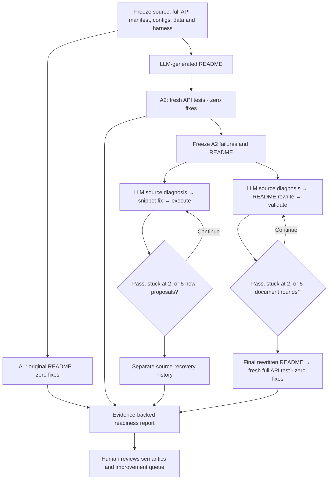

# Active A2-only repair protocol

Registered September 8, 2026, following the user's instruction to omit repair
of the original README. This supersedes the priority study's planned 2×2
continuation. Historical results and the original protocol remain evidence;
the revised study is not a completed factorial 2×2 experiment.

| Stage | Input | LLM work | Evaluation and output |
|---|---|---|---|
| A1 | Original README, frozen full API manifest | Generate one API-use test per API | Zero snippet fixes; original-document control only |
| A2 | Generated README, same manifest/data/harness | Generate one API-use test per API | Zero snippet fixes; freeze failures and documentation |
| Source recovery | Eligible A2 failures and the unchanged A2 README | One source/tests diagnosis, then up to five new snippet proposals | Round 0 is retained A2; report cumulative recoveries at rounds 1–5, provider events, errors, costs and stop reasons |
| README repair | Independently, the same retained A2 result and generated README | Source-informed diagnosis and up to five document rewrite rounds per API | Keep document diffs and native validation decisions; `stuck_rounds=2`; zero snippet fixes inside document validation |
| B2 | Final rewritten generated README | A fresh audience generates new tests with no recovery history or source diagnosis | Fresh zero-fix evaluation of the entire manifest, including prior passes to detect regressions |
| Evidence review | Native results, generated code, fixtures, active assertions and replay | Agent may propose diagnoses/improvements | Human reviews semantic claims and proposed codebase changes; native pass is not independent correctness certification |

The diagram's source diagnosis is cached once per API in source recovery;
the repeated arrow does not imply a new diagnosis each code round. The document
loop retains its existing source/error diagnosis behavior. Both branches start
from A2, never from one another's repaired output. Original-document repair
(historical B1) is **omitted**, not pending or zero success.

## Execution and ownership

`driver.py:main` adopts existing A1/A2 workers. As soon as A2 completes, it runs
source recovery sequentially, then schedules only B2 document repair and its
dependent fresh evaluation. A1 continues as a parallel control and does not
block the A2 repair chain. Repositories can run in parallel.
Each has its own watchdog, report namespace and physical recovery copy. No
running API worker is relaunched during the controller handoff.

`watchdog_adoption.py:AdoptedProcess` tracks process identities and descendants
across controller death. It refuses to infer successful exit from a vanished
PID; native completion artifacts can independently satisfy the completion gate.
It never signals adopted processes. A missing process table blocks relaunch.

`snapshot.py` copies inputs without baseline output state, checks the interpreter,
recorded supervisor inventory and target-package import path, and compares
package name/version sets. `validation.py` checks source, data, manifest,
documentation, scaffold, models and engine. `compatibility.py` permits only the
already reviewed schema-2→3 bookkeeping/transport migration and explicitly
records unreconstructed historical output state. Missing native snippet binding
remains a validation limitation; case-colliding unbound scripts are blocked.

`runner.py` isolates each API/round/provider invocation, relocates tslearn's
import root for deeper directories and supplies only the previous snippet to
the fixer. It does not edit the library, fixtures, harness or README.
`engine.py:recover` saves every proposed code round and provider event; identical
inputs resume, changed inputs require a separate identity. Provider failures
do not consume a code-fix round. Different APIs use hashed output directories.

All new jobs retain the existing shared Gemini request-start gate, three-second
spacing, 300-second request timeout and two configured SDK attempts. There is
one recovery worker per repository, no additional overlapping repair worker in
that repository. Each repository has at most its A1 control plus one A2/repair
worker, preserving the original two-worker baseline envelope. This controls
local scheduling; it is not a guarantee of
provider token quota availability or freedom from 504s.

Source provider blocks get another opportunity after B2, so they do not prevent
the README branch from starting. Validation blockers remain explicit. Source
recovery uses a fixed eligible A2-failure denominator; provider and infrastructure
exclusions are listed separately. Five means **five new proposals plus retained
A2 round zero**, not five total test attempts. The accepted stuck threshold is two.

## Reporting and deadline

`reporting.py` refreshes each repository's HTML, Markdown and JSON every 30
seconds in `data_validation/pipeline_v2/<repo>/`. The existing snapshot observer
includes that directory in Wednesday's 10:45 AM evidence package. Use its
`README.md` index as the current protocol entry point; older 2×2 dashboards are
historical views and can still display the omitted B1 as missing.

`batch.py` exports complete source recovery code/error/diagnosis histories into
the report's `source/cases/`. `native_comparison.json` reports A2−A1, B2−A2,
B2 passes on the same source-eligible A2-failure cohort, and A2-pass→B2-fail
regressions. Do not calculate a factorial interaction without original repair.

Native outcomes, assertions-on replay outcomes and independently reviewed
correctness stay separate. Thumbnailator's native assertion behavior is retained;
its independent replay remains necessary and cannot certify the entire repair
pipeline. Final reporting must retain data formats, concrete samples, API calls,
assertions, effective YAML and package/provenance limitations.

The deadline is September 9 at 11 AM Pacific. Completion remains conditional on
provider availability; the report must show partial results if necessary.
MDAnalysis, Sedona and RDPro reruns remain deferred from this priority package.
