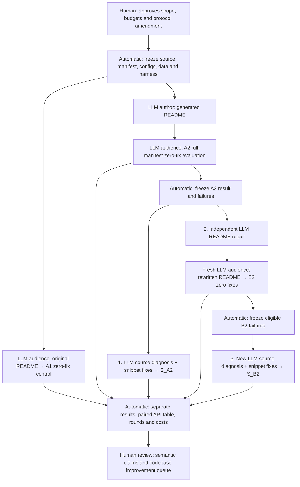

**Current scheduling amendment:** [Independent repository admission](INDEPENDENT_SCHEDULING.md) removes the global wait and resumes source-provider retries independently of A1. The older scheduling section below is historical. Measurement rules remain unchanged.

**Input handoff correction:** [Verified A2 errors and CLI paths](INPUT_HANDOFF_CORRECTION.md) supersedes the initial-error-seeding caveat below for repositories whose handoff status is `prepared`. The document-round restart limitation remains.

# AIDEAL: three separate repair stages

Registered September 8, 2026, after the user approved the third stage.
This is an **adaptive protocol amendment**: A2 and some source-recovery outcomes
were already observed. It is not a retrospective preregistration. Existing v2
measurements and code remain intact; v3 adds a separate post-B2 extension.

| Label | Input and denominator | Allowed LLM work | Measured output |
|---|---|---|---|
| A1 | Original README; full frozen manifest N | One fresh audience test; zero snippet fixes | Original-document control; no repair loop |
| A2 | Generated README; same N | One fresh audience test; zero snippet fixes | Generated-document baseline |
| **1. S_A2** | Frozen eligible A2 failures F_A2; original generated README | One successful source/tests diagnosis, then up to five new snippet proposals per API | Native recovery, cumulative rounds 1–5, retained A2 as round zero |
| **2. README repair → B2** | Independent selection from the original A2 failures | Source-informed document repair: up to five configured doc rounds per API invocation, stuck threshold two; zero snippet fixes within validation | Rewritten README, then **fresh zero-fix full-manifest B2** |
| **3. S_B2** | Freeze eligible failures F_B2 from completed B2; rewritten README fixed | New source/tests diagnosis, then up to five new snippet proposals per API | Separate post-B2 recovery; retained B2 as round zero |

## Experimental boundaries

1. **Immutable endpoints.** Never overwrite A1/A2/B2 scores with recovery
   successes. `B2 + S_B2` is a named composite, not a fresh-reader score.
2. **No cross-arm assistance.** README repair does not receive S_A2 snippets
   or diagnosis. The fresh B2 audience gets the rewritten document and fixed
   harness/input context, without a separate repair history. S_B2 gets B2's
   failing snippet/error and a new diagnosis; it does not inherit S_A2 fixes.
3. **Frozen denominators.** Use F_A2 and F_B2 separately. Eligible categories
   are compile, runtime, timeout, no-correctness-check and unknown. Provider
   failures block baseline completion; infrastructure outcomes are excluded
   from source recovery with reasons. After selection, validation-blocked APIs
   remain in the denominator. Include B2 regressions among eligible S_B2 targets.
4. **Matched treatment checks.** Require equal ordered manifest, API identities,
   source, input fixtures, scaffold, native engine, model roles, context scope,
   execution policy and interpreter. Permit document and output-path changes.
   Per-cell inventory hashes are recorded; package/import probes compare the
   actual baseline runtime with its private copy. Historical compatibility
   migrations remain explicitly qualified, not silently discarded.
5. **Equal source-recovery rules.** Both source stages use the exact registered
   runner/prompt adaptation, five **new** proposals after round zero, and stop
   after two consecutive equal failure categories/error prefixes (160 chars).
   README, fixture, harness and library edits are outside these source arms.
6. **Different document loop.** The document loop's two-stuck rule considers
   unchanged diagnosis and error, rather than the source loop's error-prefix
   rule. It can make a deep-dive, diagnosis, rewrite and validation call per
   round. Equal numeric limits do not imply equal work or identical stopping.
7. **Separate ledgers.** Code proposals, document rounds, provider events,
   watchdog attempts, diagnosis calls, native passes, replay outcomes and
   semantic review are distinct. The source runner caches successful diagnosis;
   provider failures do not consume a code proposal. Unknown SDK retries stay unknown.

## Reporting and interpretation

Report A2−A1 and B2−A2 on N as paired **descriptive** differences. For each API
in F_A2 compare S_A2 recovery, fresh B2 success, and the B2+S_B2 composite.
Also report S_B2 recovery/F_B2 and the subset of B2 regressions recovered.
Do not compare recovery percentages with different denominators as a causal
effect. Keep per-repository results; show any pooled macro/micro choice explicitly.

This run is adaptive, single-run, uses shared fixtures, and selects failures
observed under stochastic generation. B2 reuses the API/fixture domain that
informed repair: it measures transfer to a fresh generation attempt, not held-out
API generalization. No significance, optimal stopping, universal readiness or
equal-cost source-access claims follow from these results. RDPro is retained
historical context, not an additional matched replication of this amendment.

Native Java acceptance retains its historical assertion setting. Assertion-on
replay and target/input/oracle review remain separate; neither alone certifies
the whole document-repair pipeline. Suggested developer changes enter the
evidence-backed human review queue and do not mutate the measured libraries.

## Observed legacy method limitations

The frozen document worker can restart an unfinished API after interruption or
provider failure. Therefore five configured doc rounds are not proof of five
total lifetime attempts. The v3 observer audits round starts and completed
validation outcomes from append-only stderr and flags counts over five; partial
round starts are not mislabeled as completed rewrites. Retain the raw log and
latest `docfix.json`/document diffs. Missing historical draft versions stay missing.

The document worker selects targets from A2 but reads its initial snippet/error
context from the **B2 error log**. Selection alone does not prove A2 error evidence
was seeded there. The active v2 adapter does not explicitly seed it; this is a
method limitation and must not be described as a verified error-grounded repair
for every first round. Source context is still supplied by the deep dive.

The document loop can target infrastructure failures that have catalog entries;
the source stages exclude infrastructure outcomes. Report actual document targets
and the matched F_A2 subset, without claiming all treatment denominators are equal.
Fixing these legacy behaviors requires a separately versioned, matched doc-repair
run; do not rewrite their history or patch running/frozen workers silently.

## Automatic execution and write ownership

The three existing v2 controllers continue untouched. The new single-writer
observer starts with read-only admission checks and makes **no additional model
calls** until all three priority B2 job graphs have succeeded and their A2 source
passes have no pending/provider retry work. A1 control retries can continue.

One additional model worker serves S_B2 cases across repositories in turns,
using the existing account-wide Google rate-state file and three-second request
spacing. This preserves the existing gate; it is not a complete token-quota
guarantee. There is no separate Gemini pool. Provider-blocked cases wait at least
300 seconds before another attempt; completed cases are reused by identity.

S_B2 uses physical project copies under the supplied `--work`, separated from
native worktrees, S_A2 copies and the audit output. A nonblocking output lock
prevents duplicate observers. The report observer writes only `pipeline_v3`;
the old observers retain their own namespaces. Every case rechecks unchanged
baseline hashes and uses the source runner's input/script binding checks.

The launch plan closes admission of **new APIs** Wednesday at 10:15 AM Pacific.
It does not kill an in-flight case. Passive reports update every 30 seconds;
the existing 10:45 AM deadline snapshot includes this directory, even if partial.
The previous ETA covered stages 1–2 only; S_B2 adds work and has no promised
completion time. MDAnalysis, Sedona and RDPro reruns remain deferred.

## Code and configuration map

Paths below are relative to the main AIDEAL repository root.

| Component | Code/function | LLM or automatic? |
|---|---|---|
| Current A2 branch scheduling | `experiments/external/recovery/driver.py:main`, `b2_jobs` | Automatic; existing workers unchanged |
| Source treatment and five-round state | `recovery/runner.py:run`, `recovery/engine.py:recover` under `experiments/external` | Runner calls diagnosis/fixer LLM; state machine deterministic |
| Source diagnosis | `grail-agent/src/aideal/deepdive.py:deep_dive_run`; default `deep_dive.md` | LLM with source/test/call-site context |
| Snippet proposal | `grail-agent/src/aideal/doc_checks.py:comprehension_check`; `comprehension_write_exec.md` adapted in `recovery/runner.py` | LLM proposal; deterministic native execution |
| Document repair | `grail-agent/src/aideal/docfix.py:doc_fix_run`; `docfix_diagnose.md`, `docfix_rewrite.md` | LLM deep dive, diagnosis, rewrite and fresh validation |
| v3 admission/matching | `experiments/external/post_b2/evidence.py:inspect`, `matched`, `cohort` | Automatic, read-only, fail closed |
| v3 queue/lock/deadline | `experiments/external/post_b2/__main__.py:main` | Automatic; no provider call while waiting |
| S_B2 case and paired table | `experiments/external/post_b2/stage.py:one`, `prepare`, `compare` | Existing source LLM runner, separate evidence and outputs |
| HTML and actual-round audit | `experiments/external/post_b2/report.py:publish`, `document_audit` | Automatic; no LLM |
| Registered hashes/rules | `experiments/external/post_b2/protocol.yaml` | Frozen source-implementation hashes and amendment record |
| Deployment | `experiments/external/post_b2_watchdog.yaml` | Machine-specific launch paths; module itself takes portable path arguments |
| Human review | `experiments/external/readiness/WORKFLOW.md` | Human accepts/rejects semantic interpretation and proposed library changes |

Read-only preflight uses the same module/paths without `--watch`. Tests use
temporary fixtures/mocked providers and never execute a paid model call.
