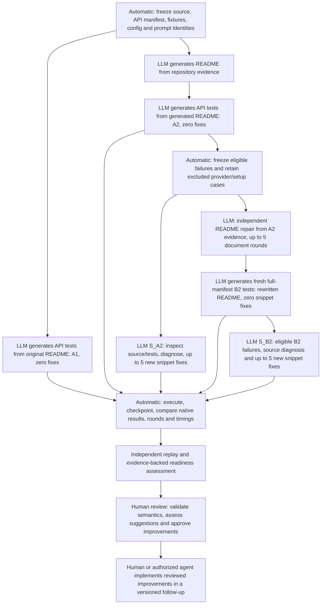

# AIDEAL operational correction and pipeline memo

Snapshot: September 8, 2026, 14:10 PDT. Deadline: September 9, 11:00 PDT.
Live evidence: [dashboard](REPORT.html), [status](STATUS.md), [per-API timings](API_TIMINGS.csv),
[enrollment](ENROLLMENT.json), [isolated harness replay](harness_replay_20260908/summary.json).
This memo is a dated interpretation; the linked dashboard refreshes every minute.

## The experiment being run

A1 is an independent control; it does not block A2 repair. B1 original-README
repair is omitted. A2 is round zero, followed by up to five NEW source proposals.
S_A2 keeps the generated README unchanged and does not supply successful snippets
to the independent document branch. B2 tests the full manifest again, so it can
both recover failures and introduce regressions. S_B2 changes test snippets, not
the library or the already measured README. Source loops retain stuck_rounds=2;
this is a registered stopping rule, not proof that more attempts could not help.
Native B2, source-assisted composite, harness replay and assertion replay are
separate measurements. Native acceptance does not certify semantic correctness.

Each repository enters its next stage when its own prerequisites are ready.
Source eligibility excludes provider and infrastructure classifications; tslearn
currently has 32 source-recovery targets, not all 60 A2 nonpasses. Some generated
nonexistent imports are classified infrastructure by the legacy harness: these
must remain visible in the excluded-failure audit, not disappear from full N.
Document target selection and source eligibility are recorded separately.

## Corrections under our control

- New matching baseline workers use a registered 600-second request deadline,
  one SDK attempt and the unchanged 630-second outer guard. Historical workers
  used 300 seconds and two SDK attempts. Model/prompt/temperature are preserved.
- Exact requests have exclusive locks, persisted exponential cooldowns of
  5/10/20/up to 30 minutes with bounded jitter, and per-SDK-attempt telemetry.
  Deferrals send no request and consume no snippet-fix round.
- Preflight validates declared input files and hashes, then creates only the
  enrolled condition's output directory. Generated API snippets remain unchanged.
- Explicit file/directory guidance is implemented and documented for a NEW
  matched prompt revision. It is not silently inserted into these frozen prompts.
- The passive report distinguishes pass, compile failure, execution failure,
  setup/import block, provider wait and not-started stages. It makes no model calls.

YAML gives the harness configuration; it cannot force generated code to use it.
The observed path failures had three different causes: an uncreated harness
output directory; treating outputPath=thumbnail.png as a directory; and inventing
a repository fixture path. Only the first is corrected by mkdir. The latter two
remain generated-code/input-contract failures unless a separately registered
prompt or recovery treatment repairs them.

## Real execution evidence for the directory correction

Three saved mir_eval B2 snippets were each executed twice in isolated directories,
with the snippet bytes and original input fixtures unchanged. Only output-directory
existence differed. No Gemini call was made and no native score was overwritten.

| API | Missing-directory control | Directory created |
|---|---|---|
| load_tempo | FileNotFoundError | Passed native checks |
| load_key | FileNotFoundError | ValueError: generated file has the wrong column format |
| load_wav | FileNotFoundError | Generated normalization assertion failed |

This diagnoses one recovered harness failure and two remaining failures. It does
not certify the entire documentation-repair pipeline or all APIs.

## Observed transport outcome

The naturally started tslearn A2 worker PID 12853 logged an actual SDK request
and server timeout of 600 seconds. Both previously persistent provider cases
returned responses: compute in 390.62 seconds, jacobian_product in 381.84 seconds.
Both then failed their generated tests: compute used unsupported SoftDTW keyword
`ts1`; jacobian_product imported unavailable `squared_distance_profile` from
`tslearn.metrics`. No generated code was hand-fixed to make either pass.

A2 therefore finished at 175/235 native passes, 32 execution failures and 28
setup/import classifications. These two successes of transport are evidence
that the mitigation helped these requests, not proof that every 504 is solved
or that every historical timeout shared the same cause.

Thumbnailator A1 adopted the policy in worker 16216. mir_eval A1 and tslearn A1
had not yet adopted it at this snapshot; existing workers finish naturally.

## Progress at the snapshot

| Repository | A1 native | A2 native | B2 native | S_A2 | S_B2 |
|---|---|---|---|---|---|
| mir_eval | 70/148; 26 provider pending | 135/148, finished | 137/148, finished | 13/13 recovered | 11/11 recovered |
| Thumbnailator | 129/149; 3 provider pending | 127/149, finished | 139/149, finished | 20/22 recovered; 2 stuck | 8/10 recovered; 2 stuck |
| tslearn | 121/235; 34 provider pending | 175/235, finished | Not started | 8/32 recovered; 24 pending | Awaiting B2 |

There are about 20 hours 50 minutes until the deadline. tslearn A2's provider
barrier has cleared, which improves the outlook; its source and README/B2 work
still needs actual execution. A complete study cannot yet be guaranteed because
63 A1 provider cases remain and tslearn B2 is unmeasured. The report is already
available and updates automatically, with unresolved cases explicitly retained.
MDAnalysis, Sedona and RDPro reruns remain deferred from priority work.

## Robustness and remaining limits

49 offline checks passed in 1.74 seconds, covering provider persistence, duplicate
exclusion, actual SDK timeout/retry behavior using MockTransport, fixture checks,
bootstrap activation, preserved adopted workers, report semantics and post-B2
prerequisites. Six additional isolated harness executions are summarized above.
No running experiment was restarted or deleted. No duplicate API pipeline was
launched. The only new supervisor runs the passive report observer.

Worktrees, output directories and per-process journals are separate. The recovery
admission lock reserves native capacity and permits one supplemental caller only
when the local envelope remains at most six; existing request starts are spaced
at least three seconds apart. This bounds this study, not unrelated users of
the same Gemini account or its token/day quotas. Provider latency remains external.

Historical checkpoints have attempt duration but not reliable start/end times:
missing idle retry intervals are reported unavailable, not invented. New logs
record invocation and SDK attempt start/end, duration, next retry eligibility,
and hashes. Native fingerprints predate this operational amendment; policy and
adapter hashes are therefore additional mandatory provenance. The SDK hook is
version-pinned and uses a private method; upgrading dependencies requires review.
The small modules use POSIX file locking, so a Windows port needs an equivalent.
Legacy document retries can restart an unfinished document round; those starts
must be audited rather than treated as five guaranteed distinct successful fixes.

## Code reference map

Paths below are relative to the main AIDEAL checkout, unless identified otherwise.

| Component | Code / function |
|---|---|
| Baseline/repair/B2 scheduling | experiments/external/recovery/driver.py: main, b2_jobs, completed_cell |
| Frozen recovery eligibility | experiments/external/recovery/validation.py: eligible, validate |
| Source diagnosis and generated test execution | experiments/external/recovery/runner.py: run |
| Resumable five-round/stuck-two logic | experiments/external/recovery/engine.py: recover |
| Post-B2 matching and failure cohort | experiments/external/post_b2/evidence.py: inspect, matched, cohort |
| Matched source treatment and post-B2 execution | experiments/external/post_b2/stage.py: one, same_source_treatment, compare |
| Shared recovery admission | experiments/external/post_b2/admission.py: native_reservation, slot |
| Versioned future-worker enrollment | experiments/external/provider_retry/enroll.py: enroll |
| Request telemetry, cooldown and timeout adapter | experiments/external/provider_retry/transport.py: Recorder, sdk_wrapper, install |
| Input validation and explicit path guidance | experiments/external/provider_retry/input_contract.py: prepare, guidance |
| Isolated unchanged-snippet diagnostic | experiments/external/provider_retry/harness_replay.py: replay |
| Searchable per-API execution and timing report | experiments/external/provider_retry/report.py: publish, provider_timing, outcome |
| Report supervisor | experiments/external/provider_operations_watchdog.yaml |

Main code commits: d983e66, 6fc2646. Enrollment branches: mir_eval A1 424b6bc,
Thumbnailator A1 e176408, tslearn A1 9fa8deb, tslearn A2 64e7041.
