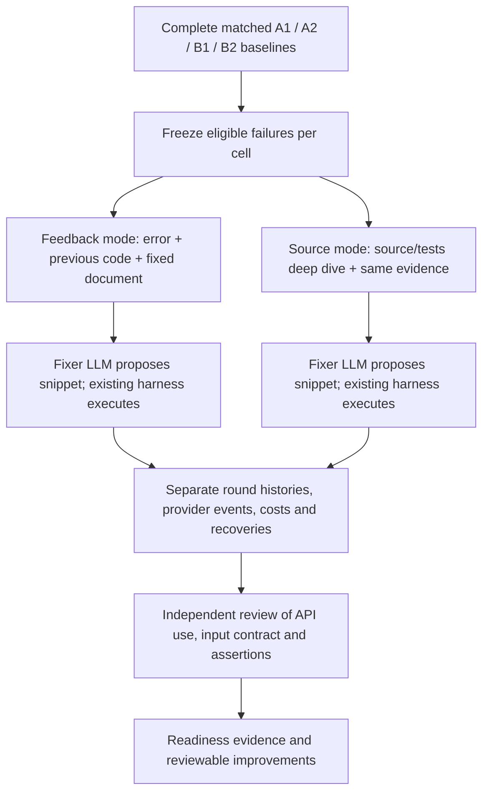

# Separate API snippet recovery

This extension is **implemented and staged**, with mocked-provider/harness tests.
It has not been run against a live provider or repository API. Existing jobs,
prompts, watchdogs and A1/A2/B1/B2 scores are unchanged. Admission remains after
the priority four-cell reports; there is no new background worker.

## Consistent experiment



For **each** baseline cell, both modes use its identical eligible failure set.
Default limit: five new code proposals, with a configurable stagnation threshold.
The baseline attempt is round zero and does not consume that new proposal budget.
Documents, source, fixtures and scaffold are fixed. The source mode reads a
bounded canonical source window, types and repository call sites through
`deep_dive_run`; the snippet fixer receives its diagnosis and the previous test.
This is bounded LLM repair, not an unrestricted repository-editing agent.

The source mode has one additional diagnosis call. Report the effect of the
source-assisted recovery package, with separate calls/tokens/time. It is not an
equal-compute estimate of source access alone. Run an equal-analysis-budget
control before making that stronger causal claim.

Keep raw native recoveries separate from independently checked recoveries.
Generated assertions can still be weak or wrong. No wrapper can establish
semantic correctness merely from a passing exit code and marker.

## Why two stuck rounds?

Two is inherited as a **provisional cost-control default**, not selected by a
threshold optimization experiment. Three permits one more attempt at the same
error; it can recover additional APIs and can also spend more on persistent
failures. Use the same threshold in both compared modes and freeze it before
launch. `--stuck-rounds 3` changes this extension only; `0` disables early stopping
within the five-round cap. Changing it creates a different recovery fingerprint.

The two rules are different:

| Loop | What increments stagnation? | What resets it? |
|---|---|---|
| Existing document repair | A rewrite rejected by the member validator; otherwise an executed failed candidate with neither a changed diagnosis nor changed error signature | A changed diagnosis or error on an executed candidate |
| New snippet recovery | Consecutive failed proposals with equal category and first 160 error characters | A different category/error prefix; success terminates |

Document diagnosis comparison normalizes whitespace/case in the first 400
characters of the `ROOT CAUSE` section. This detects textual change, not proof
of deeper understanding. The snippet rule is also a heuristic: different errors
can share a prefix, and changing paths can make equivalent errors look different.
Retain full error/code evidence for review instead of calling a stopped API
unfixable.

RDPro's `docfix_B2_all171.completed.json` contains five no-improvement stops:
`eulerHistogramCount`, `eulerHistogramSize`, `getAttributeName`, `modelToGrid`,
and `saveAsKML`. Each has two member-validator-rejected rewrites and no third
round. These records cannot determine whether threshold three would recover
them. Validator rejection itself is not proof that the referenced member is
actually nonexistent. The July-8 `zonalStats2` 31-attempt fixture mismatch is
historical evidence about one failure, not evidence for an optimal global limit.

For a pilot, allow the full five-round cap on a fixed sample and replay the
observed histories under thresholds two and three, counting recoveries lost
and calls saved. Histories already stopped early are censored. Randomized,
repeated matched runs are needed for a stronger comparison of stochastic policies.

## Files and entry points

| File | Responsibility |
|---|---|
| `protocol.yaml` | Versioned policy and staging state; no supervisor admission side effects |
| `prepare.py:prepare` | Read existing priority evidence, compare frozen effective configs, create a paired candidate queue |
| `validation.py:validate` | Refuse incomplete baselines, changed data/documents/harness/engine, and shared project roots |
| `runner.py:run` | Optional provider/harness adapter in an isolated project copy; default is preflight only |
| `engine.py:recover` | Fingerprinted state, separate provider events, bounded rounds, precise stop reason |
| `test_recovery.py` | Temporary-file tests with mocked providers and harnesses |

The September 7 [configuration audit and candidate queue](audits/2026-09-07/protocol_audit_and_queue.json)
finds matching frozen non-document protocols in all three priority repositories,
matching effective configs in their existing workers, and no observed path
conflicts. The four-cell results are still partial. Thirteen eligible mir_eval
A2 failures currently have paired candidate entries; entries are **not jobs**.

## Use after priority reports are complete

Use an isolated copy/worktree containing the same cell config, pinned source,
fixtures, documents, manifest and provisioned runtime. Keep its input paths inside
that copy. The runner checks recorded bytes and rejects a baseline whose fixture
aggregate included mutable outputs; resolve such provenance separately rather
than bypassing the check. It never builds dependencies or launches a supervisor.

```bash
env PYTHONPATH=grail-agent/src:. python -m experiments.external.recovery.runner \
  --baseline-config /baseline/configs/aideal_B2.yaml \
  --baseline-result /baseline/docs/eval/B2/comprehension.json \
  --config /isolated/configs/aideal_B2.yaml \
  --api target_api --mode source --stuck-rounds 3
```

Without `--execute`, this reads and validates only. After provisioning and
reviewing runtime compatibility, add `--execute` and supply the existing shared
`AIDEAL_GOOGLE_RATE_STATE`, interval at least three seconds, and validated
`AIDEAL_ENV_FINGERPRINT`. Keep the same model/timeout and transport settings as
the baseline. This reuses the current request-start gate, which does not enforce
provider token quotas or expose all SDK retries. Do not run during the priority
work merely because preflight passes.

All recovery outputs live under the isolated project's `.aideal_recovery/`.
A lock prevents two writers for the same recovery identity. Each proposal and
provider retry has its own directory. Repeating the exact command resumes;
changed source, tests, script, model, prompt, policy, or threshold requires a new
identity. No success is inserted into baseline checkpoints or result JSON.

Full failing scripts are hashed when recovery starts. Some historical baseline
JSON contains only truncated snippets or resumed status text, so that hash cannot
retroactively prove which script belonged to the original attempt. Review the
checkpoint and saved harness association before reporting recovery as matched.
Interpreter identity and an inventory fingerprint also do not freshly attest
every imported package. Record independent runtime and semantic review in the
final report; preflight success alone is insufficient.

```bash
env PYTHONPATH=grail-agent/src:. python -m pytest -q experiments/external/recovery/test_recovery.py
```
