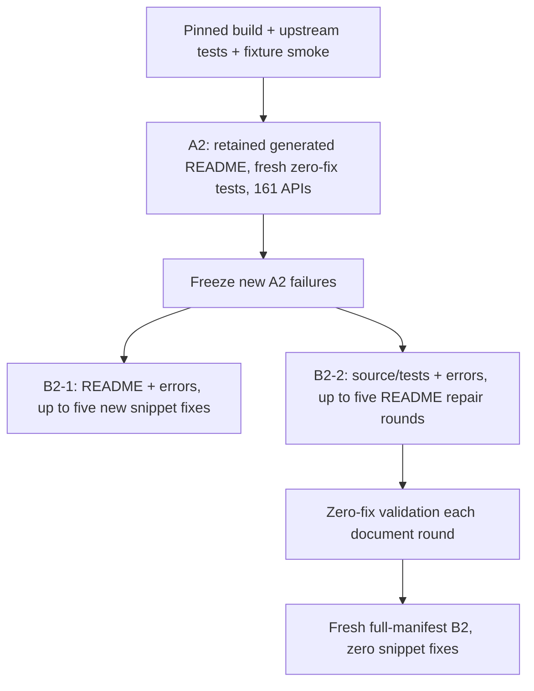

# RDPro matched continuation, September 8

The historical A2 README is reused byte for byte. Its delivered-document digest
matches the July 14 zero-fix A2 run. Historical A2 lacks recorded input components,
and its retained build directory points into a different, modified source checkout.
Its old fix5 runs also contain new round-zero attempts. None is relabeled B2-1.

This separately registered study rebuilds pinned Beast 547f7f91, executes upstream
tests and a no-LLM fixture smoke, then evaluates the validated public manifest:
161 APIs, including 88 originally documented and 73 undocumented. The 10 generated
extras are excluded. Historical A1 and 171-entry results remain descriptive history;
there is no new matched A1 and no original-document repair arm.

Both branches read the same new A2. Scheduling can be sequential while the
experimental inputs remain independent. B2-1 never receives B2-2 text or diagnosis.
Stuck threshold is two. Provider retries use 300-second invocation cooldowns,
300-second SDK timeout, two SDK attempts and a 630-second outer guard. These are
separate from repair rounds. All A2 execution failures stay in the repair denominator.

`worker.py` verifies frozen inputs and waits for priority B2-1 completion. It uses
the existing supplemental lock and the shared Google request-start gate. A single
new watchdog owns these stages; no old waiters, states or checkpoints are changed.
`feedback.py` adapts the built Scala runtime to the existing recovery runner.
`preflight.py` validates the new harness without Gemini. `report.py` publishes
counts and per-API timing into a separate dashboard namespace.

The new harness uses private fixtures/output paths, an explicit SparkSession
binding, pinned Java 8 and Spark 3.5.1/Scala 2.12.18, and two local Spark threads.
The library builds against its declared Spark 3.4.2. These are recorded changes,
not a claim of identical execution to July. Source, artifacts, config, fixtures,
scaffold, prompt, interpreter and provider policy are bound in retained evidence.
The smoke does not prove fixture suitability or semantic assertions for every API.

Launch only after build_identity.json has upstream_passed and smoke_passed true.
The watchdog resumes native checkpoints and repair journals. Detailed reports
must retain native versus independently reviewed acceptance separately. Complete
study time is unknown until A2 and repair timings are measured; the deadline is
not evidence of completion.
