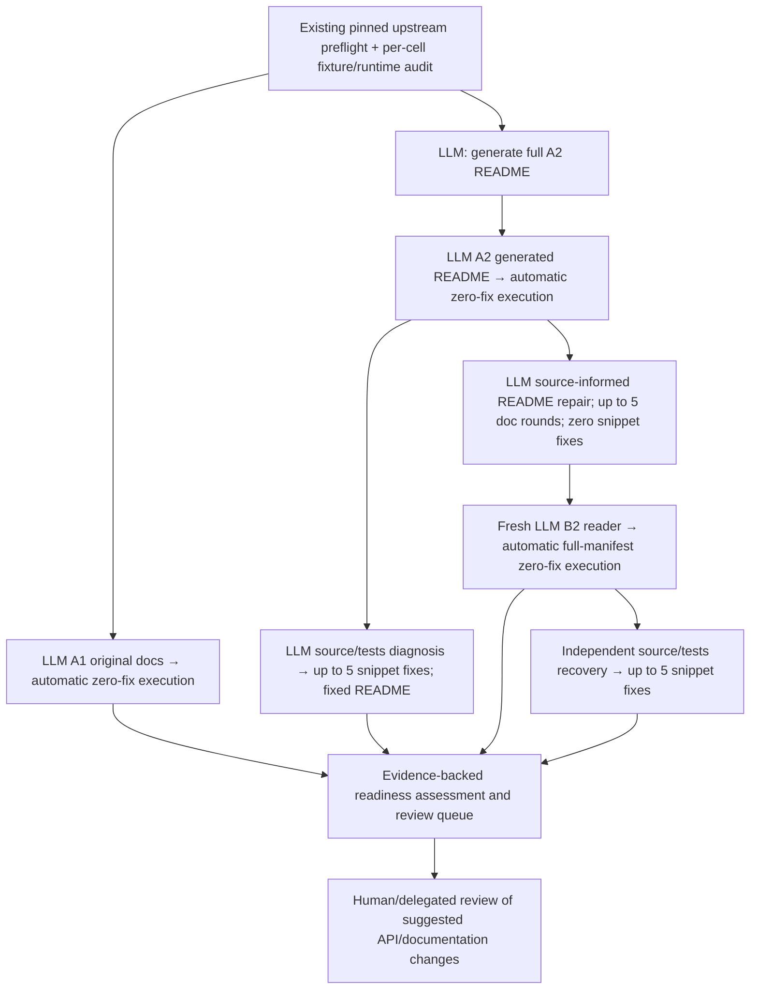

# MDAnalysis full1032 continuation

The old `GRAIL_mdanalysis_full1032_freeze` waiter remains alive and unchanged.
It waits for the superseded `tslearn_complete_full235` job. It has not executed
the full1032 API cells. The legacy four-cell plan must not be used as the current
protocol: original-document B1 repair is omitted.

`prepare_study_v4.py::prepare` creates **three new worktrees**, copies the pinned
source/runtime/fixtures physically, validates each import and fixture contract,
and writes `AIDEAL_mdanalysis_v4/study_watchdog.yaml`. It refuses to overwrite an
existing destination or plan. Resume the resulting supervisor after preparation.

Each native cell uses one frozen 1,032-name manifest (1,397 definition sites),
Gemini 3.1 Pro, relevant-document scope, 300-second local execution timeout and
zero snippet fixes. This is an explicitly versioned v4 extension, not a claim
of exact replication of the historical RDPro or priority v3 harness.

`study_worker.py` supplies preflight, one-time document initialization, source
recovery and evidence archival. The reused recovery engine reads the explicitly
selected `protocol_v4.yaml`: A2 and B2 baselines, at most five **new** fixes, one
successful source diagnosis, stuck threshold two. Provider failures remain
blocked/retryable, not credited as logical fix rounds. Library implementation
and fixtures are not repair targets. Native passes require independent semantic
review before being described as correct API use.

The main new study uses the isolated v4 execution/fingerprint/repair journal
code. Existing workers keep their original code and checkpoint identities.
Ambiguous interrupted document phases fail closed for review; resumable does
not mean silently repeating an uncertain model rewrite.

## Ownership and admission

Each A1/A2/B2 worktree owns its configuration, README, logs, execution directory
and project-local output directory. Recovery runs use separate physical copies
under `AIDEAL_mdanalysis_v4/S_A2/private` and `S_B2/private`. No mutable baseline
is shared with recovery. The generated A2 README is copied once into B2;
initialization refuses to replace a differing B2 document.

At most two MDAnalysis workers run. Admission requires all three priority B2
plans to have succeeded: their conservative native reservation is then three,
plus one existing supplemental recovery worker and two MDAnalysis workers = six
local callers at most. All use `/tmp/aideal_google_rate_gate.txt` with at least
three seconds between request starts. This is a local capacity rule, not a claim
about the provider's quota or other account users. SDK settings remain 300 seconds
and two attempts. The legacy superseded gate is not edited or marked succeeded.

The runtime preflight adopts the already running full upstream pytest check;
it does not launch a second one. Failure blocks paid work for inspection.
`environment_v4.json` records the newly checked package/version inventory;
each cell must match it before admission. This verifies package identity, not
availability or correctness of every optional feature.

## Data and developer lessons

Version-pinned MDAnalysis 2.9.0 source commit:
`81b8ef51e5bc1aa2824294ac6c52818c74975658`.
Static validation passed for 492 checked-in fixture files and the frozen
180-file original-document bundle. Explicit fixtures include PSF+DCD, PDB, GRO
and XTC. A concrete preflight constructs `Universe(adk.psf, adk_dims.dcd)` and
checks nonempty atoms and multiple trajectory frames. Per-API suitability still
needs the generated executable test and correctness witness.

The older profile said “PSF/DCD only” while YAML exposed additional formats.
The new v4 profile permits the listed checked-in fixtures and requires matching
formats to the target API. This correction is frozen before any native cell;
it is not applied retroactively to measured results.

The dashboard's Developer lessons section separates observed failures from
proposed improvements: explicit path roles, actual sample rows, public symbol
identity, optional dependency capabilities, meaningful correctness checks, and
fresh-reader validation of documentation. MDAnalysis-specific conclusions must
wait for its measured evidence.

## Deadline interpretation

Wednesday September 9, 11 AM PDT is the report deadline, not a completion claim.
For scale only, at 10–30 seconds per API, one 1,032-API pass takes 2.9–8.6 hours.
Generation → A2 → B2 are serial and documentation/source repair add work; A1 can
overlap generation. These assumptions are not an MDAnalysis forecast. Estimate
again from its actual generation and API timings. Publish incomplete stages
explicitly; never convert missing evidence to zero passes or finished cells.

The error-only documentation-repair ablation remains a proposal. Prioritize this
MDAnalysis continuation and the readable report over adding that new treatment.
